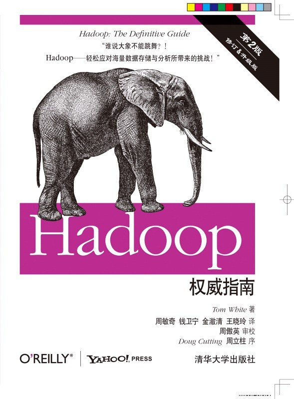

# 《Hadoop权威指南》简介

### 
 内容简介

本书介绍了Hadoop这一高性能处理海量数据集的理想工具，全书共16章，主题包括：Hadoop 简介；MapReduce 简介；Hadoop 分布式文件系统；
Hadoop I/O、MapReduce 应用程序开发；MapReduce 的工作机制；MapReduce 的类型和格式；MapReduce 的特性；如何构建Hadoop 集群；
Pig 简介；HBase 简介；Hive 简介；ZooKeeper 简介；开源工具Sqoop 以及案例分析。

**书名：**《Hadoop权威指南》 
**英文名：** _Hadoop:The Definitive Guide_ 
**版本：** 第二版 
**作者：** (美)_Tom White_ 著 
     周敏奇 王晓玲 金澈清 钱卫宁 译 
**出版社** 清华大学出版社
