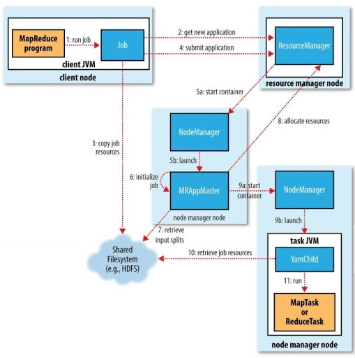

# MapReduce的工作机制

## 7.1 剖析MapReduce作业运行机制

Job对象的submit() 方法可以运行MapReduce作业。具体的过程如下：

  - 客户端，提交MapReduce作业
  - YARN资源管理器，负责协调集群上计算机资源的分配
  - YARN节点管理器，负责启动和监视集群中机器上的计算容器（container）
  - MapReduce的 application master，负责协调运行MapReduce作业，am和MapReduce作业在容器中运行，容器由资源管理器分配由节点管理器
  管理

### 7.1.1 作业的提交

Job 的submit()方法创建了一个内部 JobSubmiter 实例，并且调用其 _submitJobInternal()方法（如下图）。提交作业后 _waitForCompletion()_ 
每秒轮询作业的进度，如果发现报告有变化就更新进度到控制台。作业完成后，如果成功，就显示作业计数器，失败就把错误日志记录到控制台。

作业提交过程:

  - 向资源管理器（RM）请求一个新应用ID，用于MapReduce作业ID（上图步骤2）
  - 检查作业的输出说明。没有指定输出目录或目录已存在，作业不提交并抛出错误给MapReduce程序
  - 计算作业的输入分片。如果分片无法计算，比如输入路径不存在，则不提交作业并抛出错误
  - 将运行作业所需的资源（JAR文件、配置文件和计算所得的输入分片）复制到以作业ID命名的共享文件系统中（上图步骤3）
  - 通过调用资源管理器的 submitApplication() 方法提交作业（上图步骤4）

### 7.1.2 作业的初始化

资源管理器收到 submitApplication*() 后，就将请求传递给YARN调度器（scheduler）。调度器分配一个容器，然后资源管理器在节点管理器的管理下在容器
中启动 application master(AM) 进程。（步骤5a和5b）

AM是一个Java程序，主类是 MRAppMaster。由于需要监控任务进度和完成报告，因此AM对作业的初始化是通过创建多个簿记对象来跟踪作业来完成的（上图步骤6）。
接下来，它接收共享文件系统的输入分片（步骤7）。然后对每一个分片创建一个map任务对象和多个reduce对象（由 mapreduce.job.reduces属性
（setNumReduceTasks()方法）确定）。任务ID在此时分配。

AM会决定如何运行构成MapReduce的各个任务，如果作业很小，就在一个JVM上运行，与在一个节点顺序运行任务相比，如果application master判断在新的容器
运行比并行运行他们大，就会发生上面这种情况，这种作业叫 **uberized**，也叫 **uber**任务。

**小作业**：默认情况下，mapper少于10个，并且只有一个reducer且输入大小小于一个HDFS块的作业。（可以设置 mapreduce.job.ubertask.maxmaps等
改变这几个值）

### 7.1.3 任务的分配

如果不适合作为 uber任务运行，那么application master为该作业的map任务和reduce任务向资源管理器请求容器（步骤8）。先为Map任务请求，优先级高于
Reduce任务的请求。

reduce任务能在集群中任意位置运行，但是map任务有数据本地化的局限。理想情况下，任务是数据本地化的（_data local_）。

请求也为任务指定了内存需求和CPU数。默认的，每个map任务和reduce任务都分配到1024内存和一个虚拟内核，用户可以分配最大值最小值等（
mapreduce.map.memory.mb、mapreduce.reduce.memory.mb、mapreduce.map.cpu.vcores等）。

### 7.1.4 任务的执行

一旦任务被分配了容器，application master就通过与节点管理器通信来启动容器（步骤9a和9b）。该任务主类是 YarnChild java程序。任务运行之前，先将任务
所需资源本地化（作业配置、JAR文件和分布式缓存文件（步骤10））。最后运行map任务和reduce任务。

YarnChild在指定JVM运行，因此它运行异常不会影响到节点管理器。

每个任务都能执行搭建（setup）和提交（commit）动作，它们和任务本身在一个JVM运行。

#### Streaming

Streaming运行特殊的map和reduce任务。

Streaming任务使用标准输入和输出流与进程进行通信。

### 7.1.5 进度和状态的更新

MapReduce作业是长时间运行的批量作业，运行时间范围从数秒到数小时。这可能是一个很长的时间段。每个作业任务都有状态（status），包括：作业或任务的状态（
比如，运行中，成功完成，失败）、map和reduce的进度、作业计数器的值、状态消息或描述。

任务运行时，对其进度（progress，即任务完成百分比）保持追踪。对map任务，任务进度是已处理输入的占比。对reduce任务，比较特殊，系统会估计占比。其中，
过程分三部分，与shuffle阶段相对应（参考7.3节）。

### 7.1.6 作业的完成

当application master收到作业最后一个任务已完成的通知后，便把作业状态设置为"成功"。然后Job在轮询状态时，便知道任务已成功完成，并打印消息给用户，
然后从 **waitForCompletion()** 方法返回。Job的统计信息和计数值也在这个时候输出到控制台。

最后作业完成，application master和任务容器清理其工作状态（中间输出将被删除），**OutputCommitter** 的 **commitJob()** 方法会被调用。作业信息由作业
历史服务器存档。

## 7.2 失败

Hadoop能够处理一些故障并成功完成作业。

### 7.2.1 任务运行失败

map任务或reduce任务运行失败，任务JVM会在退出之前向父application master发送报告。

还有一种可能是任务JVM突然退出，这种情况下，节点管理器会注意到进程已经退出，并通知application master将此任务标记为失败。

### 7.2.2 application master运行失败

属性 `mapreduce.am.max-attempts`属性控制am的最多尝试次数，默认值是2，超过默认值就不在尝试并将作业置为失败。

### 7.2.3 节点管理器运行失败

如果节点管理器由于崩溃或运行非常缓慢而失败，就会停止向资源管理器发送心跳信息。

### 7.2.4 资源管理器运行失败

这是非常严重的问题，没有资源管理器，作业和任务容器无法启动。默认配置下，资源管理器是个单点故障。

为了高可用（HA），可以使用双机热备配置。

所有运行中的应用程序信息处处在一个高可用的状态存储区中（由zookeeper或HDFS备份），这样备机可以恢复出失败的主资源管理器的关键状态。

当新的资源管理器启动后，它从状态存储区读取应用程序信息，然后为集群中的所有应用程序重启application master。

资源管理器从备机切换到主机是由**故障转移控制器**（failover controller）处理的。默认故障转移是自动控制的，由zookeeper的leader选举机制确保
同一时刻只有一个主资源管理器。故障转移控制器不必是一个独立的进程，为配置方便，默认是放在资源管理器中的。

### 7.3 shuffle和排序

MapReduce 确保每个reducer的输入都是按键排序的。系统执行排序、将map 输出作为输入传给 reducer 的过程称为 _shuffle_。

#### 7.3.1 map端

map 函数执行并不是简单地将输出写到磁盘。它会利用缓冲的方式写到内存并出于效率考虑进行预排序。

如下图示，每个map任务都有一个环形缓冲区用于缓存任务输出，默认情况下，缓存区大小是 100MB，可以通过参数 **mapreduce.task.io.sort.mb**调整，一旦
达到阈值（默认80%），一个后台线程就开始把内存溢出（spill）到磁盘。在溢出写到磁盘的过程中，map会继续写出到缓冲区，如果被填满，map任务就会被阻塞掉。

写磁盘之前，先根据reducer把数据划分成相应的分区（partition）。在每个分区中，后台线程按键进行内存排序。

每次内存缓冲区达到溢出阈值，就新建一个溢出文件（spill file），因此，map任务在写完最后一个输出记录后，会有几个溢出文件。在任务完成前，溢出文件被合并
成一个已分区已排序的输出文件。配置属性 **mapreduce.task.io.sort.factor** 控制一次最多能合并多少流，默认是10。

如果至少存在三个溢出文件，则 combiner 就会在输出文件写磁盘前运行，使输出结果更紧凑，减少了写到磁盘的数据和传递给reducer的数据。如果只有一两个溢出
文件，那么就不值得使用 combiner函数，这样就不会允许 combiner函数（通过 **mapreduce.map.combine.minspills** 属性设置，默认是3）。

#### 7.3.2 reduce端

如果map 输出相当小，会被复制到 reduce 任务JVM的内存，map输出被复制到磁盘。

复制完所有map输出后，reduce任务进入排序阶段，这个阶段将合并map输出。

最后，即reduce阶段，直接把数据输入reduce函数。

#### 7.3.3 配置调优

map 阶段配置

reduce阶段配置

### 7.4 任务的执行

