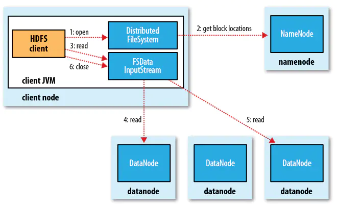
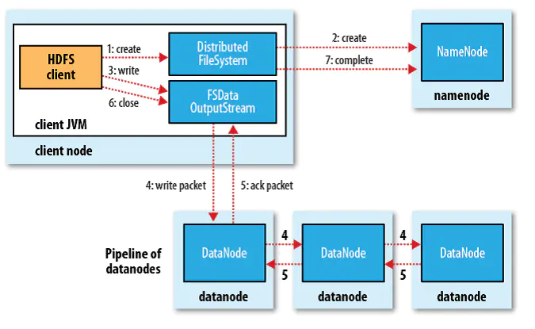

# 第三章 Hadoop分布式文件系统
<br>

当数据集超过一台物理计算机的储存能力时，就要对其进行分区。管理网络中跨多台计算机存储的文件系统称为**分布式文件系统**。

## HDFS的设计

HDFS 以流式数据访问模式来存储超大文件。

**超大文件**

> "超大文件"指至少具有几百MB、几百GB的文件

**流式数据访问**

> 一次写入，多次读取是最高效的访问模式，数据集通常由数据源生成并长时间在数据集上分析，所以读取整个数据集延迟比读取第一条记录延迟要更重要

**商用硬件**

> 普通的商用硬件作为集群

**低时间延迟的数据访问**

> 低延迟的数据访问不适合在hdfs上运行，例如几十毫秒的延迟。hdfs为数据高吞吐量优化，代价就是高时间延迟

**大量的小文件**

namenode将文件系统的元数据存储在内存中，因此文件系统所能存储的文件数受限于namenode的内存容量。

**多用户写入，任意修改文件**

文件可能只有一个 writer，写操作总是将数据添加到文件末尾，它不支持多个写入操作，也不支持任意位置修改（目前是否支持要再查阅资料）

## HDFS 的概念

### 数据块

磁盘：单个磁盘文件系统+多个磁盘块
HDFS 块（block）默认64MB。文件被划分为多个分块（chunk）

**为何这么大**

为了最小化寻址开销，这样一次寻址可以传输一整个块（64MB），数据传输远大于寻址的时间。

### namenode 和 datanode

HDFS以管理者-工作中模式运行，即一个namenode(管理者) 和多个datanode(工作者)。<br/>
namenode 管理文件系统的命名空间，它维护着文件系统树及树内的所有文件和目录。这些信息永久存储在本地磁盘上：**命名空间镜像文件**
和**编辑日志文件**。<br/>

**客户端** 通过namenode和datanode交互来访问整个文件系统。工作节点datanode受namenode和客户端调度，并定期向namenode返送它们所存储的块的列表。
没有namenode，文件系统无法使用。如果namenode损坏，文件系统上的文件将丢失，因为无法根据datanode的块重建文件。

## 命令行接口

### 基本文件操作

`fs -help`获取详细帮助文件

从本地复制一个文件到HDFS
```shell script
hadoop fs -copyFromLocal input/docs/a.txt hdfs://localhost/user/a.txt
```
hdfs://localhost 可以省略，因为已经在*core-site.xml*中指定,所以hdfs路径可以写成 */user/a.txt*(绝对路径)或者*a.txt*
复制到hdfs home目录中<br/>

从HDFS复制文件到本地
```shell script
hadoop fs -copyFromLocal a.txt a.copy.txt
```

创建文件夹和查看文件列表：
```shell script
hadoop fs mkdir books
hadoop fs -ls .
```
查看文件返回的结果与Unix ls -l 类似。

## Hadoop 文件系统

HDFS是Hadoop抽象文件系统的一个实现。 Java抽象类 `FileSystem`定义了文件系统接口，

### 接口

Hadoop是Java写的，Java API 可以调用所有的Hadoop文件系统。文件解释器也是一个Java应用。

#### Thrift

Thrift API 通过把Hadoop文件系统包装成 Apache Thrift服务来访问。需要使用时，只需运行Thrift服务，并以代理方式访问Hadoop文件系统

#### HTTP

只读接口。namenode中web服务器（50070端口）以xml提供目录列表，datanode的web服务器（50075端口）提供文件数据传输。

#### FTP

使用FTP协议与HDFS交互。

### 数据流

#### 读文件



如上图所示，读文件过程按下面的顺序进行：
1. 客户端调用FileSyste对象的open()函数来打开文件（步骤1），这个对象是分布式文件系统的一个实例。
2. DFS 使用RPC调用namenode，确定文件起始块位置（步骤2）。每一个块，namenode返回存有该块的副本的datanode地址。这些datanode根据他们与客户端的距离来排序（
根据网络拓扑）。如果客户端本身就是一个datanode并保存有相应数据块复本时，该节点将从本地datanode中读取数据。DFS返回给客户端**FSDataInputStream**
对象读取数据，管理datanode和namenode的I/O。
3. 客户端对上面这个流调用read()方法（步骤3），**DFSDataInputStream**将连接距离最近的datanode，并对数据流反复调用read()方法（步骤4），读取到块
的末端后，关闭连接，再寻找其他下一块最佳datanode（步骤5）。
4. 客户端从流中读取数据是按照打开**DFSDataInputStream**与datanode新建连接的顺序读取，它也需要询问namenode来检索下一批所需块的datanode位置。
一旦客户端完成读取，就对**FSDataInputStream**调用close()方法（步骤6）。

读取数据时，如果**FSDataInputStream**与datanode通信时遇到错误，它便从另一个最邻近的datanode读取数据。它也会记住故障节点，防止出现反复读取该节点后续的块。
**FSDataInputStream**也会做校验和确认数据是否完整，如果发现块有损坏，它会在读取块复本前通知namenode。

namenode告知客户端每个块最佳datanode地址，不保存数据，数据流分散在集群的所有datanode上，所以datanode可以扩展到大量的并发客户端。同时，namenode仅返回块
位置的请求（信息存储在内存，高效）。

##### 网络拓扑与Hadoop

>节点、机架、数据中心  
>衡量两个节点带宽方法：将网络看成一棵树，两个节点距离是到最近的共同祖先的距离之和。  
>Hadoop无法自行定义网络拓扑结构，它需要人工配置。  

##### 总结：

简单来说写文件的顺序就是请求分布式文件系统打开文件，DFS会调用namenode检索datanode地址，然后返回给客户端流对象，客户端通过流与datanode交互读取数据，
读取到块末端，关闭流，再读下一个块，读完一批，客户端再请求下一批datanode的地址，继续读。


#### 写文件



如上图所示，读文件过程按下面的顺序进行：
1.客户端对 **DistributedFileSystem**对象调用 create() 函数创建文件（步骤1）。
2.DistributedFileSystem 对namenode创建RPC调用，在命名空间创建一个新文件（步骤2）。namenode执行检查确保该文件不存在，并且客户端有创建文件的权限。
检查通过，namenode就记录一条记录，否则，文件创建失败并向客户端抛出IOException。
3.DFS（代表DistributedFileSystem缩写）向客户端返回一个 FSDataOutputStream 对象，由此客户端开始写入数据。写入时（步骤3），DFSDataOutputStream
将数据分成一个个的数据包并写入内部队列（数据队列 data queue）。
4.**DataStreamer**处理数据队列，它会根据datanode列表来要求namenode分配新块存储数据备份。DataStreamer将数据包流式传输到管线第一个dataname，再依次写入（步骤4）。
5.写入后，内部还有一个确认队列（ack queue），所有确认信息收到后，数据包会被删除（步骤5）。
6.写入完成后，对数据流调用close()方法（步骤6）。
7.close()方法会将剩余的数据写入datanode管线中，等待namenode确认（步骤7）。


写入期间（5.）发故障，则执行以下操作：
1. 关闭管线，把数据包添加回数据队列。确保下游datanode不会漏掉。
2. 给存储在另一个正常datanode的数据块一个新标识，并将标识传给datanode，以便故障恢复后可以删除此数据块。
3. 从管线中删除此数据节点，并把数据写入剩下的datanode。块复本量不足时，要在另一个节点创建一个新复本。


