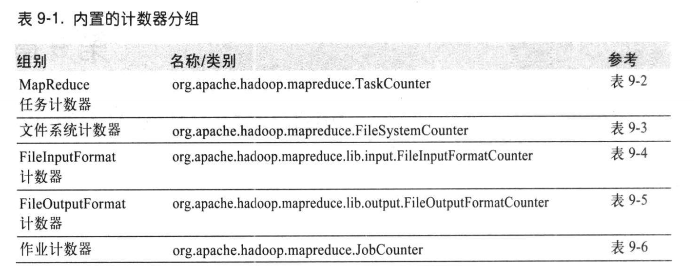

# 第九章 - MapReduce的特性

## 9.1 计数器

计数器是收集作业统计信息的有效手段之一，用于质量控制或应用级统计。

### 9.1.1 内置计数器

Hadoop 为每个作业维护若干内置计数器，以描述多项指标。例如，某些计数器记录已处理的字节数和记录数。

### 9.1.2 用户定义的Java计数器

定义一个枚举类，然后在map函数中定义计数器的增加。

## 9.2 排序

排序是MapReduce的核心技术。

### 9.2.1 准备

### 9.2.2 部分排序

### 9.2.3 全排序

如何使用Hadoop产生一个全局排序文件？最简单的方法是使用一个分区。但是这样效率太低。

替代方案：生成全局排序文件，根据时间范围创建几个分区，但是这样可能导致数据量不太一样，比如某个区间数据过多或过少。

解决：通过Hadoop自带的采样器采样，然后根据数据量分为不同的分区。

## 9.3 连接

连接即join操作。连接操作如果由mapper执行，则称为map端连接；如果由reducer执行，则称为reduce端连接。

### 9.3.1 map 端连接

map 端连接会在数据到达map函数之前就执行连接操作。为达到此目的，map的输入数据需要进行分区并以特定方式排序。

map 端连接可以连接多个作业的输出，只要这些作业的**reducer数量相同、键相同并且输出文件不可切分**。

利用 org.apache.hadoop.mapreduce.join 包的 CompositeInputFormat 类来运行一个map端连接。

### 9.3.2 reduce 端连接

由于reduce 端连接不要求输入数据集符合特定结构，因而**reduce端连接比map端连接更常用**。但是两个数据集均需要经过shuffle阶段，所以reduce端连接的
效率会更低。基本思路是mapper为各个记录标记源，并使用连续键作为map输出键，使相同的键放在同一个reducer中。

## 9.4 边数据分布

### 9.4.1 利用Configuration类配置作业

Configuration类（原JobConf类）的各种setter方法能够方便地配置作业的任一键-值对。

### 9.4.2 分布式缓存

一般一个作业中，各个文件通常只需要复制到一个节点一次。

#### 1. 用法

**GenericOptionsParser** 类： **-files**选项指定待分发的文件；使用 **-archives**选项向自己的任务中复制存档文件（JAR、ZIP、tar等）；
**-libjars**选项会把JAR文件添加到mapper和reducer的类路径中。

#### 2.工作机制

用户启动一个作业后，Hadoop会把如上参数指定的文件复制到分布式文件系统（一般是HDFS）之中。接着，任务运行前，节点管理器将文件从分布式文件系统复制到
本地磁盘（缓存）。使任务能够访问这些文件。此时，文件被本地化。

节点管理器还会为缓存中的文件维护一个计数器来统计文件被使用情况。任务运行时，该任务所使用的所有文件计数器加1，任务执行完毕，计数器减1。当文件不再使用
中（计数为0），才能删除。