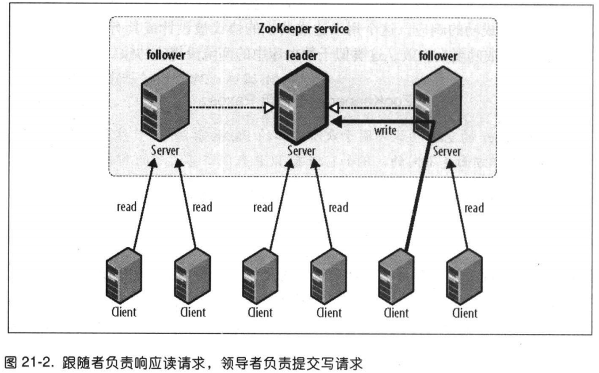
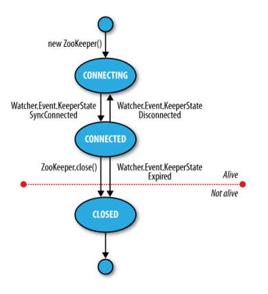

# 关于ZooKeeper

ZooKeeper 是Hadoop的分布式协调服务。

特点：

    - ZooKeeper是简单的，ZooKeeper 核心是一个精简的文件系统。  
    - ZooKeeper是富有表现力的。ZooKeeper的基本操作是一组丰富的 "构件"，可用于实现多种协调数据结果和协议。相关例子包括：分布式队列、分布式锁、
    和领导者选举。 
    - ZooKeeper 具有高可用性，可以避免单点故障。 
    - ZooKeeper 采用松耦合交互方式，参与的各方不需要同时存在。 
    - ZooKeeper 是一个资源库。 
    
## 21.3 ZooKeeper 服务

### 21.3.1 数据模型

ZooKeeper维护着一个树形层次结构，树中的节点被称为 znode。znode可以用于存储数据，并形成一个ACL。ZooKeeper被设计用来实现协调服务（一般是小数据
文件），不是大容量存储，因此一个znode存储限制在1MB内。

ZooKeeper 数据访问具有原子性，客户端在读取一个znode时，要么读所有数据要么读失败。

znode通过路径引用。

### 21.3.2 操作

|操作	|描述|
|:---|:---|
|create|在ZooKeeper命名空间的指定路径中创建一个znode|
|delete|	从ZooKeeper命名空间的指定路径中删除一个znode|
|exists	|检查路径中是否存在znode|
|getChildren	|获取znode的子节点列表|
|getData	|获取与znode相关的数据|
|setData	|将数据设置/写入znode的数据字段|
|getACL	|获取znode的访问控制列表（ACL）策略|
|setACL	|在znode中设置访问控制列表（ACL）策略|
|sync	|将客户端的znode视图与ZooKeeper同步|

更新操作有条件。在使用delete或setData操作时必须提供被更新的znode版本号（可以通过exists获取），版本号不匹配则操作失败。

#### 1. 集合更新

`multi` 操作用于将多个基本操作集合成一个操作单元，确保这些操作同时成功或者同时失败（事务的概念），保证原子性。

#### 2. 关于API

主要是Java和C，可以同步或者异步执行。

#### 3. 观察触发器

在exists、getChildren 和 getData这些读操作上设置观察，这些观察可以被写操作create、delete 和 setData触发。

#### 4. ACL 列表

每个znode创建时会带有一个ACL列表，用于决定谁可以对它执行哪种操作。

ACL依赖zookeeper客户端身份验证机制。验证机制如下：

    - digst 通过用户名和密码来识别客户端
    - sasl 通过Kerberos识别
    - ip 通过客户端ip地址来识别

例：使用digst的方式验证

```java
ZooKeeper zk = new ZooKeeper("", 1000, null);
zk.addAuthInfo("digest", "user:password".getBytes());
```


### 21.3.3 实现

ZooKeeper 服务有两种不同的运行模式。一种是**独立模式**（standalone mode），即只有一个ZooKeeper服务器。这种模式比较简单，适合测试环境，不能
保证高可用性和可恢复性。在生产环境中ZooKeeper 通常以 **复制模式**（replica mode）运行于一个计算机集群（**集合体**（ensemble））上。
ZooKeeper 通过复制实现高可用，只有集合体超过一半的机器处于可用状态，就可以提供服务。因为必须超过半数，所以如果是6台服务，挂了三台，就不能提供服务
了，基于这个原因，一般一个集合体通常包含奇数台机器。

ZooKeeper 所做的就是确保对znode树的每个修改都会复制到集合体中超过一半的机器上，如果少于半数机器故障，则至少有一台会保存最新状态，其余副本最终会
 更新到这个状态。
 
具体实现并不简单，ZooKeeper 使用 Zab协议，该协议包括两个无限重复的阶段。
 
#### 1. 阶段1：领导者选举

所有机器通过一个过程选举出一台**领导者**（leader）机器，其他机器是**跟随者**（follower）。一旦半数以上的跟随者已经将其状态与领导者同步，则表明
这一阶段已经完成。

#### 2. 阶段2：原子广播

所有写请求会被转发给领导者，再由领导广播给跟随者。当半数以上的跟随者将修改持久化后，领导者才提交这个更新，客户端才会收到更新成功的响应。这个协议是原子
性的，要么成功要么失败。类似数据库的两阶段提交协议。

领导者出现故障，其余机器会选出另外一个领导者。之前的领导者恢复正常会成为新领导者的跟随者继续提供服务。领导者选举过程很快。大约只需200ms。

### 21.3.4 一致性

一个跟随者可能滞后于领导者几个更新。对Zookeeper来说，理想情况下，每个客户端都连接到与领导者状态一致的机器上，但是客户端对此无法控制。



每一个对znode树的更新都被赋予一个全局唯一ID，成为 _zxid_(Zookeeper Transaction ID)。Zookeeper 要求对所有更新进行编号并排序，它决定了分布式
系统的执行顺序。

以下几点考虑保证了数据一致性。
1. 顺序一致性

客户端的更新是按发送顺序被提交的。

2. 原子性

每个更新要么成功，要么失败。

3. 单一系统映像

一个客户端无论连接的哪台服务器，它看到的都是相同视图。

4. 持久性

一个更新一旦成功，结果就会被持久化并且不被撤销。这表明更新不受服务器故障影响。

5. 及时性

任何客户端看到的滞后系统视图是有限的，不会超过几十秒。

出于性能的原因，所有读操作都是从内存获取，它们不参与写操作的全局排序。使用sync方法可以让所连接的服务器强制跟上领导者。

### 21.3.5 会话

Zookeeper 客户端会配置包含集合体的所有服务器列表。启动时客户端会尝试连接其中一台服务器，如果失败，则连接下一台。

建立连接后，这台服务器就会为该客户端创建一个新的会话。每个会话都有一个超时时间设置（由创建会话的应用来设定）。如果服务器在超时时间段内没有收到任何
请求，则会话过期。会话通常会长期存在，而会话过期是比较罕见的。

Zookeeper 客户端可以自动进行故障切换，且在另一台接替故障服务器后，所有会话（相关的短暂znode）也是有效的。

#### 时间

滴答（tick time）参数定义了Zookeeper 中的基本时间周期。

### 21.3.2 状态

通过 getState() 方法查询对象状态。

```java
public States getState()
```
建立连接的过程中，新的Zookeeper 实例处于 CONNECTING 状态，一旦建立连接，它就进入 CONNECTED 状态。



如果调用了close() 方法或者会话超时，实例会切换成 CLOSED状态。


### 21.4 使用ZooKeeper来构建应用

使用ZooKeeper 来写一些应用程序

#### 21.4.1 配置服务

#### 21.4.2 可复原的 ZooKeeper应用

#### 21.4.3 锁服务

分布式锁给不同的进程提供互斥机制。分布式锁可以用于分布式应用的领导者选举，在任意时间，持有锁的那个进程就是系统的领导者。

思路：首先指定一个作为锁的znode，称为 /leader，希望获取锁的客户端创建一些短暂顺序znode，作为锁的子节点，任意时刻，顺序号最小的客户端持有锁。ZooKeeper
服务负责分配顺序号。例：两个客户端分别创建了 /leader/lock-1 和 /leader/lock-2， lock-1 这台客户端是领导者，会持有锁。

通过删除 /leader/lock-1 即可简单的释放锁，客户端进程死亡也会释放锁

申请锁的伪代码：

1. 在锁znode下创建一个名为lock-的短暂顺序znode，并记住它的实际路径，即create方法的返回值

```java
String path = zk.create("/leader/znode-", null, null, CreateMode.PERSISTENT);
```

2. 查询锁znode的子节点并设置一个观察
3. 如果在步骤1中创建的znode在步骤2返回了（具有最小的顺序号），则获得锁，退出
4. 等待步骤2的观察通知，转到步骤2

##### 1.羊群效应

**羊群效应（herd effect）** 指大量客户端收到同一事件的通知，但实际上只有很少一部分需要处理这一事件。在这种情况下，只有一个客户端获取锁，但是维护的
过程和向所有客户端发送观察事件会产生峰值流量，会对ZooKeeper 服务器造成压力。

为了避免出现羊群效应，需要优化通知，只通知当前顺序号的下一个节点。

##### 2.可恢复的异常

由于创建顺序znode是非幂等操作，所以不能简单地重试。原因是重试可能导致创建多个顺序znode但是只有一个znode被客户端记录，这样就会产生一个永远删不掉
的孤儿znode。

客户端会话ID是一个长整数，并且在ZooKeeper服务 中是唯一的，因此非常适合在连接丢失后用于重新识别客户端，可以通过调用Java 的getSessionId()方法
获取会话ID。

在创建顺序id时采用 _lock-<sessionId>-_ 这样的命名方式，最终的znode名称就是 _lock-<sessionId>-<sequenceNumber>_。

##### 3.不可恢复的异常

一个客户端的会话过期，那么它的短暂znode将会被删除，已持有的锁会被释放。使用锁的应用程序应该清理它的状态。

##### 4.实现

Java有ZooKeeper的原生锁实现，叫 **WriteLock**。


