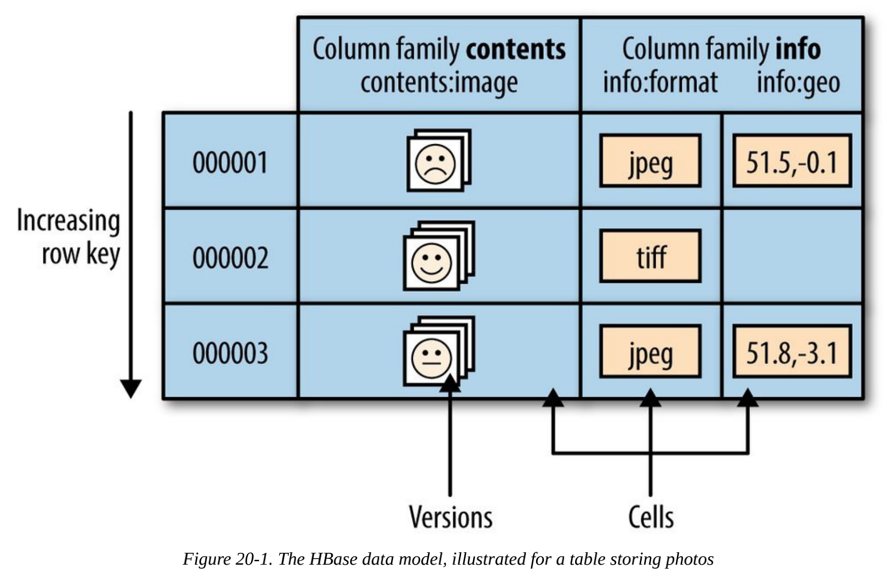
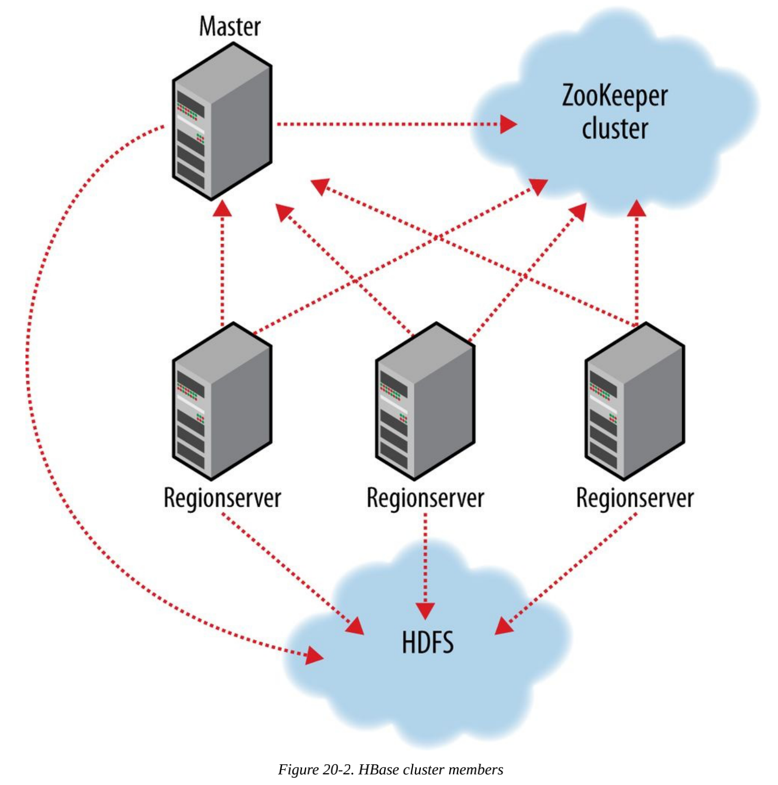

# 第二十章 - 关于HBase

## 20.1 HBase 基础

HBase是一个在HDFS基础上开发的面向列式的分布式数据库。使用HBase可以实时地随机访问超大规模数据集。

HBase并不是关系型数据库，它不支持SQL。

### 背景

于2006年发起，起源于Google 的论文bigtable，2010年成为Apache顶级项目。

## 20.2 概念

### 20.2.1 数据模型的 "旋风之旅"

应用把数据存放在带标签的表里。表由行和列组成。表格的 "单元格"（cell）由行和列的坐标交叉决定，是有版本的。默认情况下，版本号是自动分配的，是插入时的
时间戳，单元格内容是字节数组。

表中行的键也是字节数组。表中的行根据行的键值（表的主键）进行排序。排序根据字节进行。所有对表的访问都要通过表的主键。



行中的列被分为 "列族"（column family）。同一个列族所有成员前缀都一样。比如 _info:format_ 和 _info:geo_ 都是列族 _info_ 的成员。列族的前缀
必须由 "可打印的"（printable）字符组成。修饰性的结尾字符可以为任意字节。列族和修饰符之间始终以冒号（:）分隔。

物理上，所有的列族成员都一起存放放在文件系统中。由于调优和存储都是在列族这个层次上进行的，所以最好使用所有列族成员都有相同的 **访问模式**（access pattern）
和大小特征。

#### 1. 区域

HBase 自动把表水平划分成**区域**（region）。每个区域由它属于的表、它的第一行和最后一行（不包含这行）来表示。区域是在HBase集群上分布数据的最小单位。
如果数据太大，表会被放在服务器集群上，其中每个节点都负责管理表所有区域的一个子集。

#### 2. 加锁

无论事务牵扯多少列，对行的更新都是 "原子的"（atomic）。

### 20.2.2 实现

HBase也是主从架构，一个master节点协调管理一个或多个regionserver从属机。HBase主控机（master）负责启动（bootstrap）一个全新的安装，把区域分配
给注册的regionserver，恢复regionserver故障。master负载很轻，regionserver负责多个区域的管理及相应客户端的读/写请求。regionserver还负责
区域的划分并通知HBase master有了新的子区域（daughter region），这样一来，master把父区域设置为离线，并用子区域替换副区域。



HBase依赖于ZooKeeper。默认情况下，它管理一个ZooKeeper实例，也可以配置ZooKeeper集群。

#### 运行中的HBase

HBase内部保留名为 _hbase:meta_ 的特殊目录表（catalog table）。他们维护着当前集群上所有区域的列表、状态和位置。其中区域名为键，区域所属的表名、
区域的起始行、区域创建时间以及对整体的MD5哈希值组成。

例如表 TestTable中起始行 _xyz_ 区域名如下：

```text
    TestTable,xyz,1279729913622.1b6e176fb8d8aa88fd4ab6bc80247ece.
```

Regionserver 的写操作首先追加到 "提交日志"（commit log）中，然后加入内存中的memstore。如果memstore满了，它的内容会被 "刷入"（flush）文件
系统。

提交日志（commit log）存放在HDFS上，即使一个regionserver崩溃，提交日志仍可用。如果发现一个regionserver 不能访问，主控对死掉的regionserver
的日志进行分割。

在读的时候首先查看区域的memstore。如果在memstore中找到了需要的版本，查询就结束了。否则按照次序从新到旧检查"刷新文件"（flush file），直到找到
猫族查询的版本。

有一个后台进程负责在刷新文件个数到达一个阈值时压缩它们。它把多个文件重新写入到一个文件。在regionserver上，另外还有一个独立的进程监控着刷新文件的大小，
一旦文件大小超过阈值，便对区域进行分割。

## 20.4 客户端

多种交互方式

### 20.4.1 Java

HBase是Java开发的。范例：

```java
public class ExampleClient {

  public static void main(String[] args) throws IOException {
    Configuration config = HBaseConfiguration.create();
    // Create table
    HBaseAdmin admin = new HBaseAdmin(config);
    try {
      TableName tableName = TableName.valueOf("test");
      HTableDescriptor htd = new HTableDescriptor(tableName);
      HColumnDescriptor hcd = new HColumnDescriptor("data");
      htd.addFamily(hcd);
      admin.createTable(htd);
      HTableDescriptor[] tables = admin.listTables();
      if (tables.length != 1 &&
          Bytes.equals(tableName.getName(), tables[0].getTableName().getName())) {
        throw new IOException("Failed create of table");
      }
      // Run some operations -- three puts, a get, and a scan -- against the table.
      HTable table = new HTable(config, tableName);
      try {
        for (int i = 1; i <= 3; i++) {
          byte[] row = Bytes.toBytes("row" + i);
          Put put = new Put(row);
          byte[] columnFamily = Bytes.toBytes("data");
          byte[] qualifier = Bytes.toBytes(String.valueOf(i));
          byte[] value = Bytes.toBytes("value" + i);
          put.add(columnFamily, qualifier, value);
          table.put(put);
        }
        Get get = new Get(Bytes.toBytes("row1"));
        Result result = table.get(get);
        System.out.println("Get: " + result);
        Scan scan = new Scan();
        ResultScanner scanner = table.getScanner(scan);
        try {
          for (Result scannerResult : scanner) {
            System.out.println("Scan: " + scannerResult);
          }
        } finally {
          scanner.close();
        }
        // Disable then drop the table
        admin.disableTable(tableName);
        admin.deleteTable(tableName);
      } finally {
        table.close();
      }
    } finally {
      admin.close();
    }
  }
}
```

### 20.4.2 MapReduce

## 20.7 Praxis

运行HBase的常见问题

### 20.7.1 HDFS

HBase使用HDFS的方式与MapReduce使用HDFS的方式截然不同。MapReduce中，先打开文件，然后map程序处理数据，最后关闭文件。在HBase中，数据文件在启动
时就被打开，并且始终打开，目的是节省每次访问操作打开文件所需的代价。

#### 1. 文件描述符用完

一个进程默认的文件描述符数量是1024，当超过操作系统 _ulimit_ 值时，会看到错误日志"Too many open files"。要修正这个问题要增加这个值。

#### 2. datanode 上的线程用完

datanode上同时运行线程不能超过256个（dfs.datanode.max.xcievers），这会导致HBase运行异常。Hadoop2将默认值提高到4096，所以新的出现问题的可能
性比较小。

### 20.7.2 用户（Web）界面

在主控机master上运行着一个web服务器，提供了运行中集群的状态视图。默认情况下监听60010端口。

