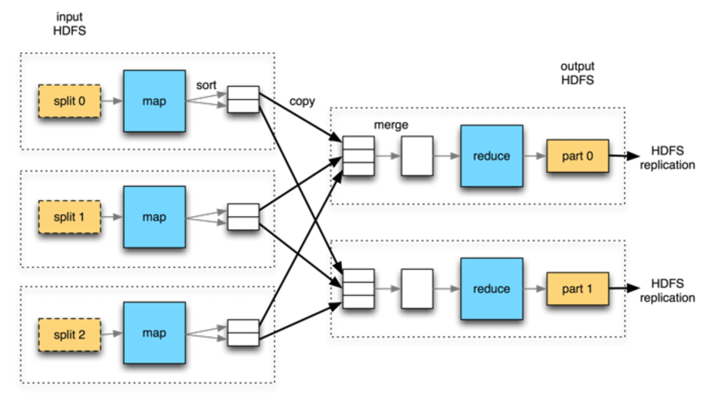

### 关于MapReduce

#### 使用Hadoop分析数据

 

##### map阶段和reduce阶段

map阶段输入原始数据，map函数可以选取需要的字段并进行逻辑过滤，比如过滤掉不符合条件的数据。map函数的输出会发送给reduce函数，
这一过程需要根据键值对/值对进行排序和分组，也就是reduce函数会根据特定key进行分组，将相同的key的value放到一个集合中，最后再计算结果

##### Java MapReduce

Java代码实现需要三样东西，一个map函数，一个reduce函数和用来运行作业的代码。

map函数由`Mapper`实现，声明一个map() 方法。

reduce函数通过`Reducer`实现，声明reduce()方法。

MapReduce作业， `JobConf`对象指定作业执行规范，指定文件输入输出路径，控制map和reduce函数输出类型，指定好后，`JobClient`的
静态函数 `runJob()`会提交作业并等待完成。

#### 数据流

作业job是客户端需要执行的一个工作单元，它包括输入数据，MapReduce程序和配置信息。Hadoop将一个作业分为多个小任务task执行，其中
包括两类：map任务和reduce任务。

两类节点控制作业的执行过程：jobtracker和tasktracker。

Hadoop将MapReduce的输入数据划分成等长的小数据块，称为**输入分片(input split)**，一般一个分片的大小趋向于hdfs块的大小，默认64MB。

Hadoop在存储有输入数据（hdfs）的节点上运行map任务，可以获得最佳性能，这就是**数据本地化优化**，这就是分片大小和hdfs块大小相近的原因，
如果分片跨越了两个块，那么map时就会有网络io，效率更低。

map任务会将其**输出写入本地磁盘**，而非HDFS，这是因为map的输出结果是中间结果，该结果被reduce任务处理后才产生最终输出结果，
作业完成时会删除map的中间结果。

如果有多个reduce任务，则每个map任务都会对其输出进行**分区**，即每个reduce任务建个分区，每个分区有很多键。下图描述了map和reduce之间的
数据流为什么称为**shuffle(混洗)**

#### Hadoop的Streaming

Hadoop提供了MapReduce的API，允许非Java语言编写map函数和reduce函数，支持Ruby,Python