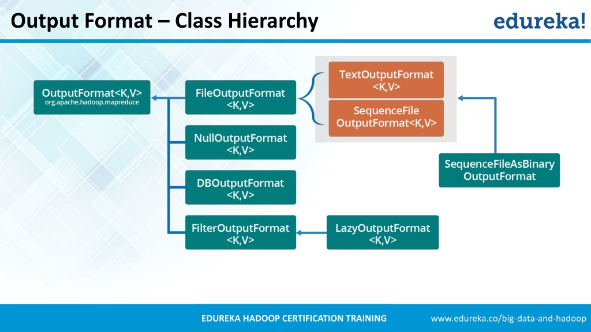

# 第八章 - MapReduce的类型和格式

## 8.1 MapReduce的类型

Hadoop 的MapReduce中，map 函数和reduce函数遵循如下格式：

> map:(K1,V1) -> list(K2,V2) 
> reduce:(K2,list(V2)) -> list(K3, V3) 

reduce 函数的输入必须与 map函数的输出类型相同。

### 8.1.1 默认的MapReduce作业

## 8.2 输入格式

### 8.2.1 输入分片与记录

一个**输入分片（split）** 就是一个由单个map操作来处理的输入块。每个map只能处理一个输入分片

TODO... 

### 8.2.2 文本输入

#### 1. TextInputFormat

TextInputFormat是的默认 InputFormat。每条记录是一行输入。键是 LongWritable 类型，存储该行在文件中的偏移量，值是它的内容。

### 8.2.3 二进制输入

MapReduce 可以处理二进制格式的数据。

#### 1. SequenceFileInputFormat类

Hadoop 顺序文件格式存储二进制的键-值对的序列。由于是可分割的（有同步点），所以reader 可以从任意点与记录边界进行同步。

### 8.2.4 多个输入

MultipleInputs 类允许为每条输入路径指定InputFormat 和Mapper。

### 8.2.5 数据库输入

## 8.3 输出格式

OutputFormat 类层次结构：

### 8.3.1 文本输出

默认输出格式是 TextOutputFormat，它把每条记录写为文本行。调用toString() 方法把它转为字符串。

### 8.3.2 二进制输出

#### 1. SequenceFileOutputFormat

它将输出写为一个顺序文件。优点：格式紧凑，易于压缩。

#### 2. SequenceFileAsBinaryOutputFormat

以原始的二进制格式把键-值对写入到一个顺序文件容器中。

#### 3. MapFileOutputFormat

把map 文件作为输出。MapFile中的键必须顺序添加，所以必须确保reducer输出的键已经排好序，要不然写出的文件是无序的。

### 8.3.3 多个输出

FileOutputFormat产生的文件放在输出目录中，每个reducer会产生一个文件并且文件由分区号命名： _part_r_00000_，_part_r_00001_。但是有时候需要
对输出的文件名进行控制或让每个reducer输出多个文件。这就需要用到 MultipleOutputFormat 类。

### 8.3.4 延迟输出

