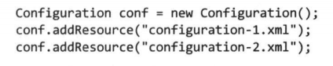

# 第六章 - MapReduce 应用开发

MapReduce 编程遵循一个特定的流程。首先写map函数和reduce函数，进行单元测试。然后写驱动程序来运行作业。

运行符合预期就可以放到集群上运行，遇到问题再修复。

优化调整：首先执行标准检查，再做任务剖析（task profiling）。分布式程序不好剖析，Hadoop提供了 _钩子(hook)_ 来辅助分析。

写MapReduce程序之前，需要先配置Hadoop。

## 6.1 用于配置的API

Hadoop中的组件是通过Hadoop自己的API来配置的。一个 `Configuration`实例（org.apache.hadoop.conf下）代表配置属性及其取值的一个
集合。每个属性由String来命名，值是多种类型，Java基本类型和其他有用的类型（String、Class、java.io.File）。

`Configuration` 从资源（比如xml配置文件）中读取属性值。

### 6.1.1 资源合并

当有多个资源文件时，按顺序添加配置

属性会覆盖，除非在property中定义成final类型。

### 6.1.2 变量扩展

属性值可以定义为 **${size}** 系统属性，可以通过 **System.setProperty("size", 4)** 来配置

## 6.2 配置开发环境

> 在HDFS中，可以通过在客户端系统运行whoami命令来确定Hadoop用户标识（identity）。 
> 如果Hadoop用户标识不同于客户机上的用户账号，可以通过设置 `HADOOP_USER_NAME` 环境变量来显式设定Hadoop用户名。 
> 默认情况下，系统没有认证机制，后面会介绍如何使用Kerberos认证。

## 6.3 用MRUnit写单元测试

## 6.4 本地运行测试数据

## 6.5 在集群上运行

## 6.6 作业调优

## 6.7 MapReduce的工作流