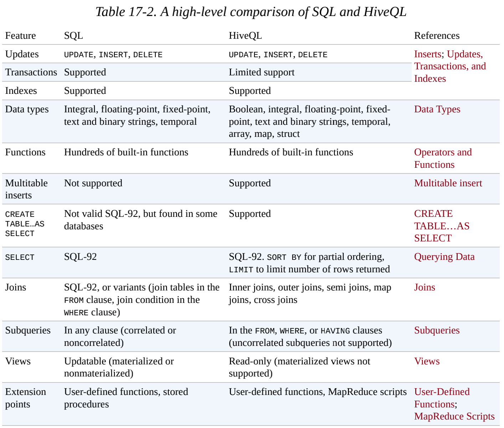
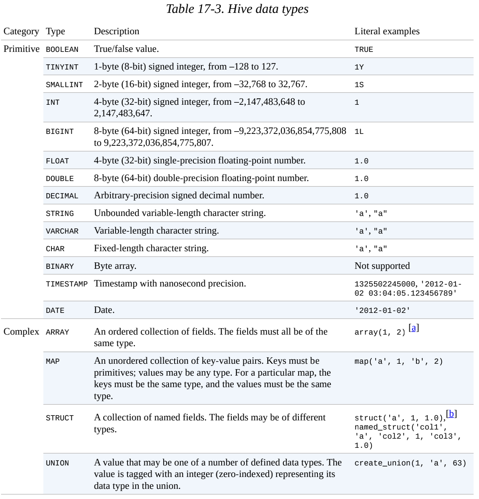

# 第十七章 - 关于Hive

## 17.3 运行Hive

### 17.3.1 配置Hive

Hive 用XML配置文件进行设置。配置文件为hivesite.xml，它在Hive的 _conf_ 目录下。

传递 --config 选项参数给hive命令，可以重新定义配置

```shell script
 hive --config /Users/tom/dev/hive-conf
```

Hive 还允许向hive命令传递-hiveconf选项来为单个会话（per-session）设置属性。

#### 1. 执行引擎

Hive的原始设计是以MapReduce作为执行引擎，目前Hive也支持使用Tez和Spark执行引擎。

使用哪种引擎由属性 hive.execution.engine 来控制，其默认值为mr。

#### 2. 日志记录

Hive错误日志：_${java.io.tmpdir}/${user.name}/hive.log_

### 17.3.2 Hive服务

输入 hive --service help 获得可用的服务列表。

* cli Hive的命令行接口，默认
* hiveserver2 以Thrift服务的服务器形式运行。
* beeline 以嵌入式方式工作的Hive命令行接口，或使用JDBC连接到一个HiveServer2进程
* hwi Hive的web接口
* jar 与hadoop jar等价
* metastore 默认情况下，metastore和Hive服务运行在同一进程里。默认端口9083

#### Hive客户端

* Thrift客户端
* JDBC驱动

### 17.3.3 Metastore

metastore 是hive元数据的集中存放地。主要有两部分：服务和后台数据的存储。默认情况下metastore服务和Hive服务运行在同一JVM中，默认一个内嵌的以本地
磁盘作为存储的 Derby数据库实例。

## 17.4 Hive与传统数据库相比

Hive底层依赖于HDFS，随着时间的推移，Hive越来越像传统数据库。

### 17.4.1 读时模式 vs 写时模式

加载时写入数据，成为"写时模式"（schema on write）。Hive对数据的验证并不在加载数据时进行，而在查询时进行，成为 "读时模式"（schema on read）。

### 17.4.2 更新、事务和索引

HDFS 不提供就地文件更新，因此，插入、更新和删除操作引起的一切变化都被保存在一个较小的增量文件中。由metastore在后台运行的MapReduce作业会定期将
这些增量文件合并到 "基表"（base table）文件中。上述功能必须开启了事务。

Hive 0.7.0 版本引入了表级锁（table-level）和分区级锁（partition-level）。锁由zookeeper透明管理。通过 SHOW LOCKS语句获取已经获得了哪些锁
信息。默认情况下，并未启用锁的功能。

目前Hive的索引分成两类：**紧凑（compact）** 索引和**位图（bitmap）** 索引。

紧凑索引存储每个值的HDFS块号，而不是存储文件内的偏移量。位图索引使用压缩的位集合（bitset）来高效存储具有某个特殊值的行。这种索引适合存储具有较少
可能的列（如性别和国家），其实就是枚举值。

### 17.4.3 其他SQL-on-Hadoop技术

Impala 是开源交互式SQL引擎，比MapReduce性能高一个数量级。impala使用专有的守护进程，这些守护进程运行在集群中的每个数据节点上。当客户端查询时，会
首先联系任意一个运行了Impala守护进程的节点，这个节点被当做是该查询的协调节点（coordinator）。协调节点向集群中的其他守护进程分发工作，并收集结果集。

其他还有Apache Drill、Spark SQL和Presto等。

Apache Phoenix 采取其他方式，它提供基于HBase的SQL。

## 17.5 HiveQL

Hive的SQL方言被称为HiveQL，



## 17.5. 1 数据类型

Hive支持原子和复杂数据类型。



### 1. 原子类型

命名受MySQL影响，但是类型对应了Java的类型。TINYINT, SMALLINT, INT, and BIGINT 对应 Java的 byte, short, int，long。

### 2. 复杂类型

Hive 有四种复杂数据类型：ARRAY、MAP、STRUCT和UNION。STRUCT是一种记录类型。复杂类型允许嵌套

```java
CREATE TABLE complex ( 
    c1 ARRAY<INT>, 
    c2 MAP<STRING, INT>, 
    c3 STRUCT<a:STRING, b:INT, c:DOUBLE>, 
    c4 UNIONTYPE<STRING, INT> 
);
```

查询：

```text
hive> SELECT c1[0], c2['b'], c3.c, c4 FROM complex; 
1 2 1.0 {1:63}
```

### 17.5.2 操作与函数

可以在shell中输入 SHOW FUNCTIONS获取函数列表。想要查看详情用DESCRIBE命令

```shell script
hive> DESCRIBE FUNCTION length; 
length(str | binary) - Returns the length of str or number of bytes in binary data
```

#### 类型转换

原子类型有隐式转换，例如TINYINT可以转成INT，但是不能反向转换，除非使用CAST操作。

## 17.6 表

Hive的表由数据和元数据组成。数据存储在HDFS中，也可以放在其他Hadoop文件系统中。元数据在关系型数据库中

### 17.6.1 托管表和外部表

默认Hive管理数据，也可以创建**外部表**，让Hive到仓库目录以外的位置访问数据。外部表删除时只删除元数据，不删除数据，创建外部表用**EXTERNAL**关键字。

```hiveql
CREATE EXTERNAL TABLE external_table (dummy STRING) 
    LOCATION '/user/tom/external_table'; 
LOAD DATA INPATH '/user/tom/data.txt' INTO TABLE external_table;
```

### 17.6.2 分区和桶

#### 1. 分区

以分区为例，常以时间为分区字段，每天的数据存在一起，类似每天的日志。创建表时使用 **PARTITION BY** 关键字定义分区。在文件系统级别，分区只是表目录下
嵌套的子目录，数据文件中不包含这些列的值。

#### 2. 桶

优点：1. 可以获得更高的查询效率；2. 使采样更高效。

### 17.6.3 存储格式

**行格式**（row format）和**文件格式**（file format）。

1. 默认的存储格式：分隔的文本

建表如果没有指定 **ROW FORMAT** 或 **STORED AS**，那么使用默认的分隔文本，每行（line）存储一个数据行（row）。

2. 二进制文件：顺序文件、Avro数据文件、Parquet文件、ORCFile

二进制文件分为两大类，面向行和面向列。

### 17.6.4 导入数据

#### 1. INSERT语句

```hiveql
INSERT OVERWRITE TABLE target 
SELECT col1, col2 
    FROM source;
```

**OVERWRITE** 意味着目标表的内容会被SELECT语句替换掉。

## 17.7 查询数据


### 17.7.1 排序和聚集

可以使用标准SQL ORDER BY，也可以使用Hive的扩展SORT BY 。SORT BY 为每个reducer产生一个排序文件。

### 17.7.3 连接

#### 1. 内连接

内连接最简单。使用on谓词连接，只支持等值连接。

```hiveql
 SELECT sales.*, things.* FROM sales JOIN things ON (sales.id = things.id);
```

#### 2. 外连接

left join 或right join

#### 3. 半连接（Semi joins）

```hiveql
SELECT * FROM things WHERE things.id IN (SELECT id from sales);
```
等价于下面的SQL：

```hiveql
 SELECT * FROM things LEFT SEMI JOIN sales ON (sales.id = things.id);
```

#### 4. map连接

如上内连接所示，如果有一个表的连接小到足以放入内存，这就称为map连接。只需要如下配置即可启用优化选项：

```hiveql
SET hive.optimize.bucketmapjoin=true;
```

### 17.7.4 子查询

Hive对子查询支持有限。它只允许出现在select 语句的FROM后面，特殊情况下可以出现在WHERE后面。


### 17.7.5 视图

视图是一种用SELECT语义定义的**虚表**（virtual table）。在Hive中视图并不会存储到磁盘中。

## 17.8 用户定义函数（UDF）

**用户定义函数**（user-defined function，UDF）。UDF必须用Java编写。

Hive中有三种UDF：普通UDF、用户定义聚集函数（aggregate function，UADF）以及用户定义表生产函数（table-generating function，UDTF）。

* UDF 用于操作单个数据行，大多数函数都是这类。
* UDAF 接受多个输入数据行，并产生一个输出数据行。像MAX COUNT。
* UDTF 操作作用于单个数据行，且产生多个数据行（一个表）作为输出。
    
### 17.8.1 写UDF

一个UDF必须满足两个条件。

* 一个UDF必须是 org.apache.hadoop.hive.ql.exec.UDF 的子类
* 一个UDF必须至少实现了evaluate() 方法
    
```java
import org.apache.commons.lang.StringUtils;
import org.apache.hadoop.hive.ql.exec.UDF;
import org.apache.hadoop.io.Text;

public class Strip extends UDF {
    private Text result = new Text();

    public Text evaluate(Text str) {
        if (str == null) {
            return null;
        }
        result.set(StringUtils.strip(str.toString()));
        return result;
    }

    public Text evaluate(Text str, String stripChars) {
        if (str == null) {
            return null;
        }
        result.set(StringUtils.strip(str.toString(), stripChars));
        return result;
    }
}
```

注册UDF，使用USING JAR指定UDF的Java文件

```java
CREATE FUNCTION strip AS 'com.hadoopbook.hive.Strip' 
USING JAR '/path/to/hive-examples.jar';
```

### 17.8.2 写UDAF

计算一组整数的最大值

```java
package com.hadoopbook.hive;

import org.apache.hadoop.hive.ql.exec.UDAF;
import org.apache.hadoop.hive.ql.exec.UDAFEvaluator;
import org.apache.hadoop.io.IntWritable;

public class Maximum extends UDAF {

  public static class MaximumIntUDAFEvaluator implements UDAFEvaluator {
    
    private IntWritable result;
    
    public void init() {
      System.err.printf("%s %s\n", hashCode(), "init");
      result = null;
    }

    public boolean iterate(IntWritable value) {
      System.err.printf("%s %s %s\n", hashCode(), "iterate", value);
      if (value == null) {
        return true;
      }
      if (result == null) {
        result = new IntWritable(value.get());
      } else {
        result.set(Math.max(result.get(), value.get()));
      }
      return true;
    }

    public IntWritable terminatePartial() {
      System.err.printf("%s %s\n", hashCode(), "terminatePartial");
      return result;
    }

    public boolean merge(IntWritable other) {
      System.err.printf("%s %s %s\n", hashCode(), "merge", other);
      return iterate(other);
    }

    public IntWritable terminate() {
      System.err.printf("%s %s\n", hashCode(), "terminate");
      return result;
    }
  }
}
```