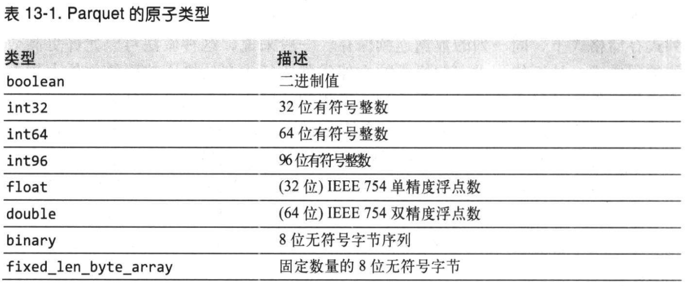
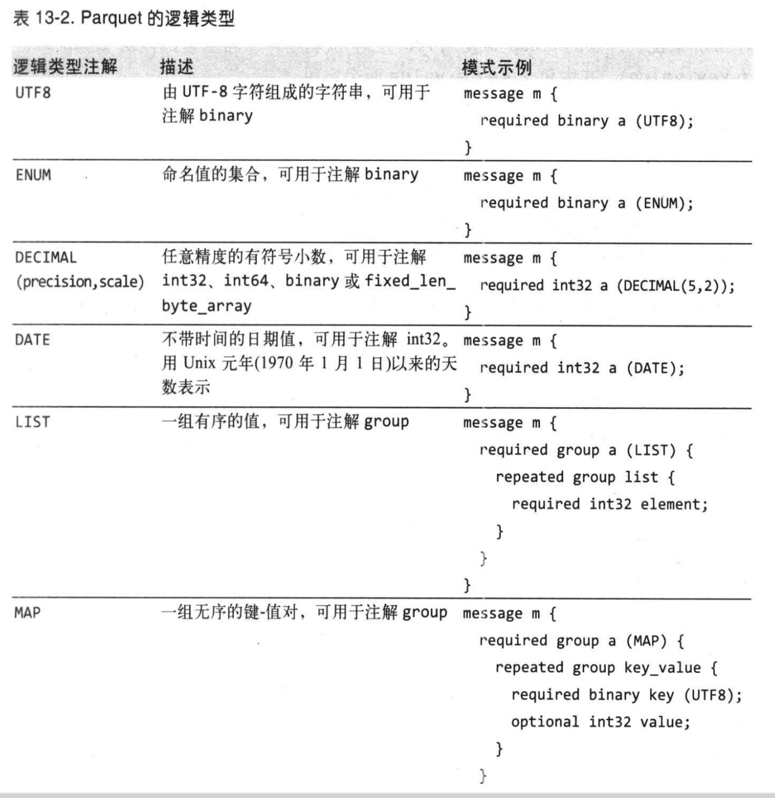
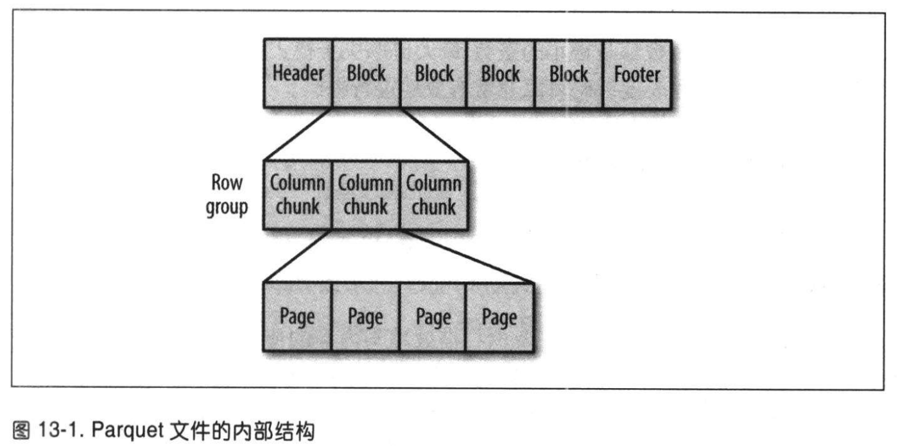
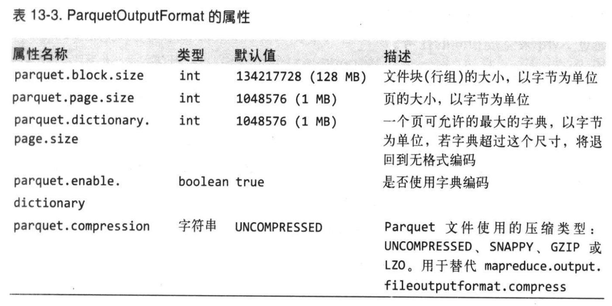

# 第13章 - 关于Parquet

Apache Parquet 是一种能有效存储嵌套数据结构的列式存储格式。

## 13.1 数据模型

原子类型：

数据通过模式进行描述，模式的根为 message， message中包含一组字段，每个字段由一个重复数（required、optional或repeated）、一个数据类型和一个
字段名称构成。

Parquet 逻辑类型：

## 13.2 Parquet文件格式

Parquet 文件由一个文件头（header）、一个或多个紧随其后的文件块（block）以及用于结尾的文件尾（footer）构成。文件的所有元数据保存在文件尾中。元
数据包括文件格式的版本信息、模式信息、额外的键值以及所有块的元数据信息。

Parquet 文件中的每个文件块负责存储一个**行组**（row group），行组由**列块**（column chunk）构成，每个列块中的数据以**页**（page）为单位存储。

由于每页的值都来自同一列，因此极有可能这些值差别不大，所以使用页作为压缩单位非常合适。

带有压缩效果的编码格式：差分编码（保存值与值之间的差）、游程长度编码（将一连串相同的值编码为一个值以及重复次数）、字典编码（创建字典，对字典编码，用
代表字典索引的整数来表示值）。还有位紧缩法（bit packing），将多个较小的值保存在一个字节中以节省空间。

在写文件时，Parquet 会根据列的类型自动选择适当的编码格式。例如，保存布尔值时，Parquet 会结合游程长度编码与位紧缩法。大部分数据类型的默认编码方式
是字典编码，但是字典太大就会退回无格式编码。触发退回的阈值是字典页大小，其默认值等于页的大小，所以一般使用字典编码，字典页不得超过一页的范围。采用的
编码格式保存在文件的元数据中。

## 13.3 Parquet的配置

Parquet 文件属性在写操作时设置。设置文件块大小需要考虑扫描效率与内存的使用。文件大，行也多，扫描效率更高，顺序I/O操作效率也高。但是每个文件块读写
都需要缓存在内存中，所以块不能太大，一般是128MB。

页是Parquet 文件的最小存储单元，因此，读取任意一行数据，就必须对这一页进行解压缩和解编码处理。所以，对于单行查询来说，页越小，效率就越高。但是较小的
页会带来较大的存储和处理开销，因为页越多，元数据（偏移值、字典）也越多。默认情况下，页的大小为1MB。

## 13.4 Parquet文件的读/写

### 13.4.1 Avro、Protocol Buffers 和Thrift

使用 AvroParquetWriter、ProtoParquetWriter或ThriftParquetWriter 及其分别对应的reader类负责完成Avro、Protocol Buffers 和Thrift模式
与Parquet模式之间的转换。

### 13.4.2 投影模式和读取模式

有时我们只希望读取文件中的少数几列，利用投影模式可以选择所需读取的列。
使用AvroReadSupport中的静态方法setRequestedProjection() 将该投影模式设置到配置中。