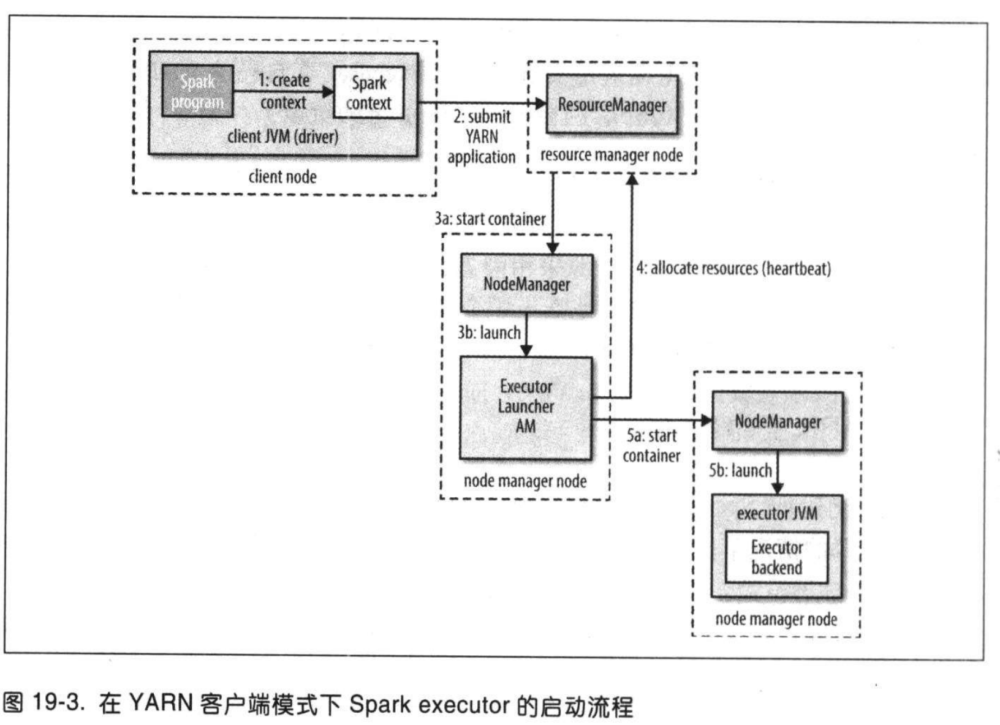

# 第19章 - 关于Spark

## 19.1 安装 Spark

官方下载地址：[https://spark.apache.org/downloads.html](https://spark.apache.org/downloads.html)


## 19.2 示例

**RDD** （弹性分布式数据集 Resilient Distributed Dataset）是Spark最核心的概念，它是在集群中跨多个机器分区存储的一个只读的对象集合。其中
"弹性"指的是Spark可以通过重新安排计算来自动重建丢失的分区。
map() 方法可以对RDD中的每个元素应用某个函数，可以将数据转成其他格式的数据。
filter() 方法输入是一个过滤谓词，是一个返回布尔值的函数。
reduceKey() 方法提供分组功能。
foreach() 方法遍历集合。
saveAsTextFile("output") 方法会触发Spark 作业的运行，它没有返回值，会计算出一个RDD，并将其分区写入到output文件中。

### 19.2.1 Spark 应用、作业、阶段和任务

Spark也有**作业**（job）的概念，而且比MapReduce更通用，因为Spark作业是由任意的**多阶段**（stage）有向无环图（DAG）构成。
这些阶段又被分解为多个**任务**（task），任务并行运行在集群的RDD分区中。

### 19.2.2 Scala 独立应用

```scala
import org.apache.hadoop.conf.Configuration
import org.apache.hadoop.mapred.TextInputFormat
import org.apache.spark.SparkContext._
import org.apache.spark.scheduler.InputFormatInfo
import org.apache.spark.{SparkConf, SparkContext}

object MaxTemperatureWithPlacement {
  def main(args: Array[String]) {
    val inputPath = args(0)
    val conf = new SparkConf().setAppName("Max Temperature")
    val preferredLocations = InputFormatInfo.computePreferredLocations(
      Seq(new InputFormatInfo(new Configuration(), classOf[TextInputFormat],
        inputPath)))
    val sc = new SparkContext(conf, preferredLocations)

    sc.textFile(args(0))
      .map(_.split("\t"))
      .filter(rec => (rec(1) != "9999" && rec(2).matches("[01459]")))
      .map(rec => (rec(0).toInt, rec(1).toInt))
      .reduceByKey((a, b) => Math.max(a, b))
      .saveAsTextFile(args(1))
  }
}
```

## 19.3 弹性分布式数据集

### 19.3.1 创建

RDD创建有三个方法：

1. 来自一个内存中的对象集合（并行化一个集合），适用于对少量输入数据进行并行CPU密集型计算；
2. 使用外部存储器（比如HDFS）中的数据集；
3. 对现有RDD进行转换。

### 19.3.2 转换和动作

RDD两大类操作：**转换**（transformation）和**动作**（action）。转换是现有的RDD生成新的RDD。动作是立即执行的，转换是惰性的。
判断类型是转换还是动作可以根据它的返回值判断，如果返回一个RDD，那么它是一个转换，否则就是一个动作。

#### 聚合转换

三个转换函数：reduceKey()、 foldByKey()和aggregateByKey()。

```scala
test("reduceByKey") {
    val pairs: RDD[(String, Int)] =
      sc.parallelize(Array(("a", 3), ("a", 1), ("b", 7), ("a", 5)))
    val sums: RDD[(String, Int)] = pairs.reduceByKey(_+_)
    assert(sums.collect().toSet === Set(("a", 9), ("b", 7)))
}
```

reduceKey() 为键-值中值重复应用二进制函数，直到产生一个结果值。键a使用加法函数（_+\_）来聚合，即（3+1）+5=9。

> **assert** 语句中使用三元等于运算符（===）来自于 ScalaTest，比起常规的等于，它能提供更多有意义的失败消息。 


```scala
test("foldByKey") {
    val pairs: RDD[(String, Int)] =
      sc.parallelize(Array(("a", 3), ("a", 1), ("b", 7), ("a", 5)))
    val sums: RDD[(String, Int)] = pairs.foldByKey(0)(_+_)
    assert(sums.collect().toSet === Set(("a", 9), ("b", 7)))
}
```
foldByKey() 必须提供一个零值（zero value），它和reduceKey()效果一样，都不能改变聚合结果值的类型。想要改变类型，需要使用aggregateByKey()。
例如，将整数聚合成一个集合：

```scala
test("aggregateByKey") {
    val pairs: RDD[(String, Int)] =
      sc.parallelize(Array(("a", 3), ("a", 1), ("b", 7), ("a", 5)))
    val sets: RDD[(String, HashSet[Int])] =
      pairs.aggregateByKey(new HashSet[Int])(_+=_, _++=_)
    assert(sets.collect().toSet === Set(("a", Set(1, 3, 5)), ("b", Set(7))))
}
```

new HashSet[Int\] 创建一个新的可变集合，使用 _+=\_ 函数把整数添加到集合中

### 19.3.3 持久化

 
**cache()** 方法将数据缓存到内存中，它不会立即缓存 RDD，相反，它用一个标志来对该 RDD进行标记，指示该 RDD应当在Spark作业运行时被缓存。

### 19.3.4 序列化

数据序列化和函数序列化（闭包函数）。

#### 1. 数据

一个executor发送到另一个executor时，使用的是Java的序列化机制，但是效率不高。

使用Kryo序列化机制对于大多数Spark程序都是一个更好的选择。Kryo是一个搞笑的通用Java序列化库。使用Kyro只需要在SparkConf中设置 spark.serializer
属性，如下所示：

```text
conf.set("spark.serializer", "org.apache.spark.serializer.KryoSerializer")
```

## 19.4 共享变量

Spark经常要访问不属于RDD的数据，使用lookup(_)函数查找表，但是使用广播变量可以更高效地完成相同的工作。

### 19.4.1 广播变量

**广播变量**（broadcast variable）经过序列化后发送到各个executor，并被缓存在那里。常规变量是作为闭包函数的一部分被序列化的，因此他们要在每个任务
中传输一次。广播变量作用类似于MapReduce的分布式缓存，不同之处在于Spark将数据存在内存中，内存不足再溢出到磁盘上。

### 19.4.2 累加器

**累加器**（accumulator）：在任务中只能对它做加法的共享变量，类似MapReduce中的计数器。

### 19.5 剖析Spark作业运行机制

在最高层，它有两个独立的实体：_driver_ 和 _executor_。driver 负责托管应用（SparkContext）并为作业调度任务。executor 专属于应用，它在应用
运行期间运行，并执行该应用的任务。一般，driver 作为一个不由集群管理器（cluster manager）管理的客户端来执行，而executor 则运行在集群的计算机上。

### 19.5.1 作业提交

当对RDD进行操作时，它会自动提交一个Spark 作业。首先 SparkContext 调用 runJob() 方法，然后将调用传递给driver的调度程序。调度程序包括DAG 调度
程序和任务调度程序。DAG将作业分解为若干阶段，这些阶段构成一个DAG。任务调度负责将每个阶段中的任务提交到集群。


### 19.5.2 DAG的构建

Spark 有两种类型的任务：shuffle map 和 result 任务。

**shuffle map任务**：类似于MapReduce中map端的shuffle。每个shuffle map任务在一个RDD分区上运行计算，并根据分区函数写到一个新分区中，shuffle
 map任务可以运行在除最终阶段的其他所有阶段中。（）后面可以是shuffle map也可以是 result 任务。
 
**result 任务**：result任务运行在最终阶段，并将结果返回给用户程序。result任务在它自己的RDD上计算，然后将结果发送给driver，再由driver将各个分区
的计算结果汇总成最终结果。

最简单的Spark任务不需要使用shuffle，因此它只有一个result任务构成，就像MapReduce只有map任务。

### 19.5.3 任务调度

任务调度程序为某个 executor 分配任务时，首先分配的是进程本地（process-local）任务，再分配节点本地（node-local）任务，然后分配机架本地（rack-local）
任务，最后再分配非本地任务或推测任务。

> Spark 利用 Akka（一个基于Actor的平台）来构建高度可扩展的事件驱动分布式应用，而不是Hadoop RPC调用。 

任务运行完成或失败都会向driver发送状态更新消息。如果失败，任务调度程序再在另一个 executor 上重新提交任务。

### 19.5.4 任务执行

步骤：

1. 确保任务的JAR包和文件依赖关系都是最新的（在本地高速缓存中保存）。如果不是最新的，就会重新下载；
2. 任务代码是序列化后的，所以需要反序列化任务代码；
3. 执行任务代码。
 
## 19.6 执行器和集群管理器

**本地模式**  executor 和 driver 运行在一个JVM中，适用于测试或者规模比较小的作业。
**独立模式**  独立模式的集群管理器是一个简单的分布式实现，它运行了一个master 和多个worker。Spark启动时，master会要求worker生成多个executor
进程。
**Mesos 模式**  Apache Mesos 是一个通用的集群资源管理器。
**YARN 模式**  YARN 是Hadoop中使用的资源管理器。每个运行的Spark应用对应一个YARN应用实例，每个 executor 在自己的YARN容器中运行。

YARN 是唯一一个能够与Hadoop 的Kerberos 安全机制集成的集群管理器。

### 运行在YARN 上的Spark

Spark有两种部署模式，一种是YARN 客户端和YARN 集群模式。YARN 客户端模式的driver 在客户端运行，集群模式的 driver 在YARN 的application master
集群上运行。

交互式组件程序（例如 _spark-shell_ 或 _pyspark_）都必须使用YARN客户端模式。

1. **YARN 客户端运行模式**

客户端模式下，driver构建一个新的SparkContext 实例。该Context 向YARN 资源管理器提交一个YARN 应用（步骤2），YARN 资源管理器启动集群节点管理
器上的YARN容器，并在其中运行一个叫 SparkExecutorLauncher 的 application master（步骤3）。ExecutorLauncher 主要用来启动YARN 容器
中的 executor，为了做到这一点，ExecutorLauncher 要向资源管理器请求资源（步骤4），然后启动 ExecutorBackend 进程作为分配给它的容器（步骤5）。



2. **YARN 集群模式**

在集群模式下，用户的driver程序在YARN 的application master上运行。使用 spark-submit 命令时需要输入 yarn-cluster 的主URL：

```shell script
spark-submit --master yarn-cluster ...
```
spark-submit 客户端会启动YARN应用，但是不会运行任何用户代码。剩余过程和客户端模式相同。


