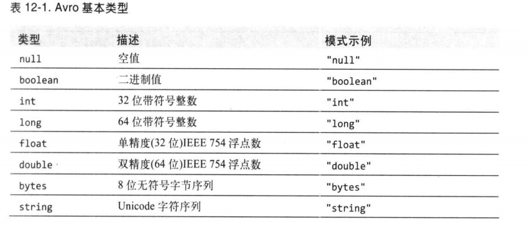

# 第十二章 - 关于Avro

Apache Avro是一个独立于编程语言的数据序列化系统。

## 12.1 Avro数据类型和模式

Avro中定义了少量的基本数据类型。

复杂类型的模式示例：

一种语言可以有多种表示或映射。所有语言都支持动态映射。Java称之为**通用映射** （generic mapping）。

Java和C++实现可以自动生成代码来表示符合某种Avro模式的数据。Java中叫**特殊映射** （specific mapping）。

第三类映射，即**自反映射**（reflect mapping），将Avro类型映射到Java已有的类型中。它的速度比通用映射和特殊映射都慢。因为Avro有自动推断能力。
比如string映射到Java的java.lang.String，array映射到Java的java.util.Collection。

## 12.2 内存中的序列化和反序列化

## 12.3 数据文件

Avro的对象容器文件格式主要用于存储Avro对象序列。

## 12.4 互操作性

使用Python编写的数据文件可以使用Java读取。

