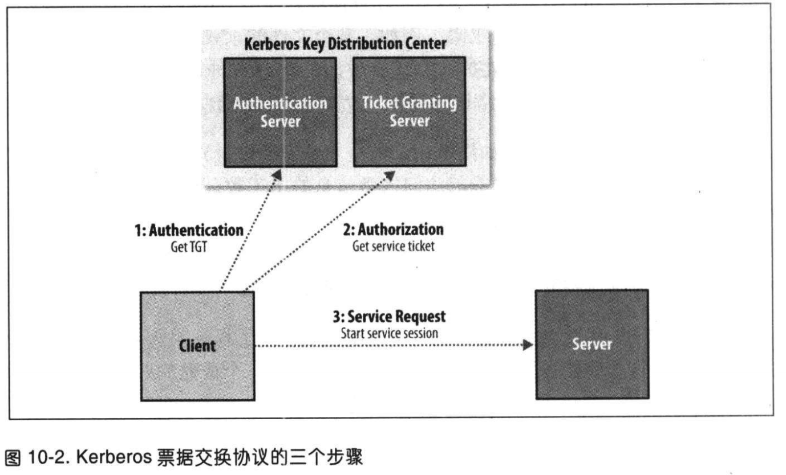

# 第十章 - 构建Hadoop集群

## 10.1 集群规范

## 10.2 集群构建和安装

## 10.3 Hadoop配置

## 10.4 安全性

### 10.4.1 Kerberos和Hadoop

步骤：
1. **认证**。客户端向认证服务器发送报文，获取一个含时间戳的票据授予票据（TGT）。
2. **授权**。客户端使用TGT向票据授予服务器（Ticket-Granting Server，TGS）请求一个服务票据。
3. **服务请求**。客户端向服务器出示服务票据，证明合法性。服务器提供服务，在Hadoop中，服务是namenode或者资源管理器。

认证服务器和票据授予服务器构成了密钥分配中心（Key Distribution Center,KDC）。整个过程如下：

### 10.4.2 委托令牌

在Hadoop中，客户端与服务器会频繁交互，每次交互都需要认证。比如一个hdfs读操作不仅与namenode交互，还会与datanode交互，这样会对KDC造成很大的压力。
为了避免多次访问KDC，委托令牌创建和使用都由Hadoop进行。

委托令牌由服务器创建（这里指namenode），可以视为客户端和服务器之间共享的一个密文。第一次通过RPC访问namenode时，客户端没有委托令牌，所以需要向KDC
认证，认证之后客户端向namenode获取委托令牌。后序调用只需要使用委托令牌即可，namenode可以验证委托令牌的真伪（该令牌由namenode使用密钥创建）。

客户端还需要特殊的委托令牌执行HDFS操作，称为 **块访问令牌**（block access token）。客户端只能访问对应的HDFS，由于namenode与datanode之间有
心跳，datanode也可以验证这些令牌。

