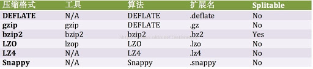
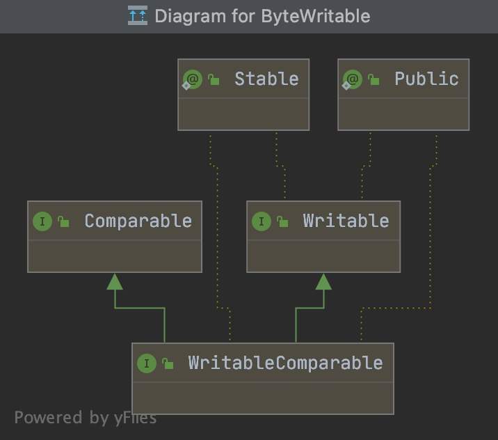
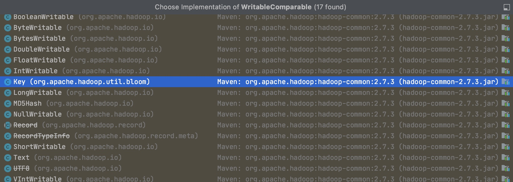

# 第四章-Hadoop I/O

## 数据完整性

检测数据：数据在第一次被引入（第一次计算并被存储下来）或者通过不可靠的通道时计算（再次计算并比较）**校验和**checksum），如果校验和不匹配则说明数据损坏。校验和也可能被损坏，但是校验和
比数据小得多，所以概率很低。

常用的**错误检测码**是CRC-32(循环冗余校验)，任意大小数据输入均被计算为32位整数校验和。

### HDFS的数据完整性

datanode 负责在验证收到的数据后存储数据以及校验和。它在收到客户端数据或复制其他datanade数据时执行这个操作。

客户端读取数据时会验证校验和。

每个datanode在后台一个线程中运行 DataBlockScanner，定期验证这个datanode的所有数据块。

客户端请求时有数据错误时的工作流程：
1.客户端读取数据时，如果有错误，则向namenode报告已损失的数据块以及其操作的datanode，最后才抛出 **ChecksumException**异常。
2.namenode将损坏的数据块复本标记为已损坏。
3.安排这个数据块的一个复本复制到另一个datanode，这样复制因子就回到期望水平。之后，删除已损坏的数据库复本。

## 压缩

文件压缩好处：减少存储文件的存储空间；加速数据网络和磁盘传输。

压缩格式：

### 压缩和输入分片

bzip2压缩格式支持**切分**（splitting），gzip无法实现从压缩的数据流任意位置读取数据，所以将每个单独块作为一个输入分片是无法实现的。

## 序列化

**序列化（serialization）** 是指将结构化对象转化为字节流，以便在网上传输或写到磁盘。
**反序列化（deserialization）** 是将字节流转回结构化对象的逆过程。

序列化经常出现在 进程间通信和永久存储。

Hadoop多个节点进程间通信是通过"远程过程调用"（remote procedure call, RPC）实现的。

**RPC** 序列化格式：

**紧凑**：
> 充分利用网络带宽。  

**快速**：
>进程间通信形成了分布式系统的骨架，所以需要尽可能减少序列化与反序列化的性能开销，这是最基本的。  ``

**可扩展**：

>协议为了满足新的需求而不断变化。需要能在RPC过程中增加新的参数并且老的格式也支持。  

**互操作**：

>对于某些系统来说，它希望支持不同语言写的客户端和服务器交互，需要在设计时满足这个需求，设计成特定的格式。  

Hadoop使用自己的序列化格式Writable接口，它格式紧凑、速度快，但很难用Java以外的语言使用。下面重点介绍Writable接口,总体了解下序列化框架和Avro。

### Writable 接口

#### Text类型

**Text** 是针对UTF-8序列的Writable类。

**易变性**：
>与String相比，它是可变的，可以通过set()方法重用Text实例。  

### ObjectWritable 和 GenericWritable

ObjectWritable 是对Java基本类型（String,enum,Writable,null或其组成数组）的通用封装。

### 序列化框架

大多数MapReduce框架使用Writable类型的键和值，这不是强制规定。只要有机制能进行类型与二进制的转换即可。

为了支持这个机制，Hadoop有一个针对可替换**序列化框架**(serialization framework)的API.

### Avro