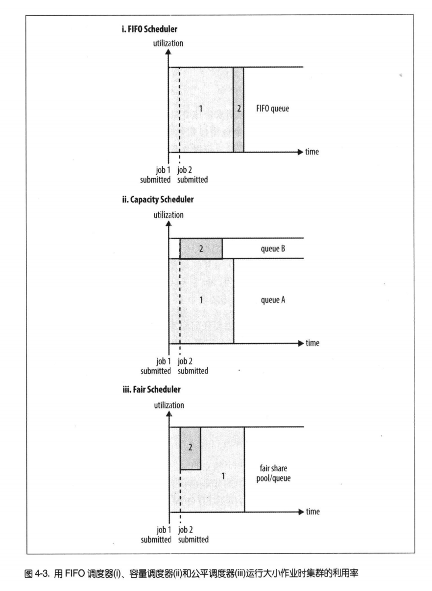

# 第四章-关于YARN(第四章增)

Apache YARN(Yet Another Resource Negotiator的缩写)是Hadoop的集群资源管理系统。在Hadoop 2被引入进来。

## 剖析YARN 应用运行机制

YARN 通过两类长期运行的守护进程提供自己的核心服务：管理集群上资源使用的**资源管理器（resource manager）**、运行在集群所有节点上且能够启动和监控
**容器**（container）的**节点管理器（node manager）**。每个容器都有资源限制（内存、CPU等）。一个容器可以是一个Unix进程，也可以是一个Linux
cgroup，取决于YARN的配置。

## YARN 与 MapReduce1相比

MapReduce1 由一个jobtracker负责作业调度和任务进度监控，tasktracker运行任务。YARN主要是由资源管理器和application master（每个MR作业一个）。

## YARN 中的调度

理想情况下，YARN应用发出的资源请求应该被立即满足，但是资源有限，可能会导致应该等待一段时间才有资源。YARN调度器的工作就是根据既定策略为应用分配资源。

### YARN 调度选项

YARN中有三种调度器可用：FIFO调度器，容量调度器（Capacity Scheduler）和公平调度器（Fair Scheduler）。FIFO将任务放到一个队列中，然后按照提交
顺序先进先出运行。

**FIFO调度器优点** 是简单易懂，不需要任何配置，但不适合共享集群，因为大任务会占用大量时间，导致其他任务一直等待。

### 容量调度器配置

容量调度器允许多个组织共享一个Hadoop集群，每个组织被分配一个单独的队列，每个队列被配置一定的集群资源。

调度配置：修改 _capacity-scheduler.xml_ （目录：_$HADOOP_HOME/etc/hadoop/capacity-scheduler.xml_ 下） 中指定不同队列的容量以及层次（子队列）。

### 公平调度器配置

公平调度器目的是为了给所有运行的任务公平分配资源

### 延迟调度

调度器都试图以本地请求为重。当一个应用请求某个节点时，很可能其他应用正在该节点运行。如果等待一小段时间（不超过几秒），再去请求节点可能就可以分配到资源。
这个特性成为延迟调度（_delay scheduling_）。容量调度器和公平调度器都支持延迟调度。

### 主导资源公平性

对于单一类型资源，如内存调度，容量和公平的概念很容易确定，但是对于复杂类型，比如内存+cpu，这种情况就要考虑如何按比例分配资源（按内存还是cpu分配）。

YARN解决这个问题的思路是，观察每个用户的主导资源，将其作为一个度量，此方法叫"主导资源公平性"。
