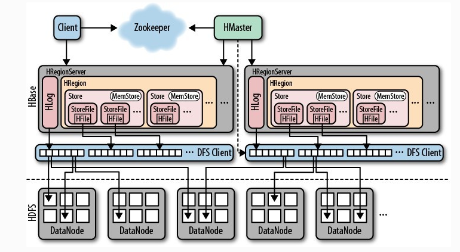
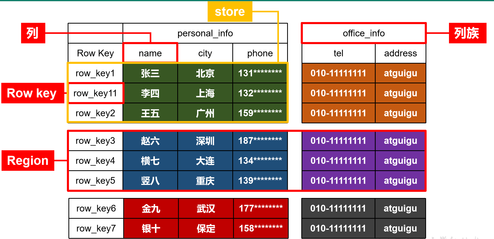
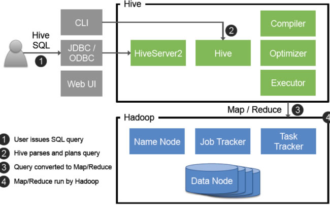
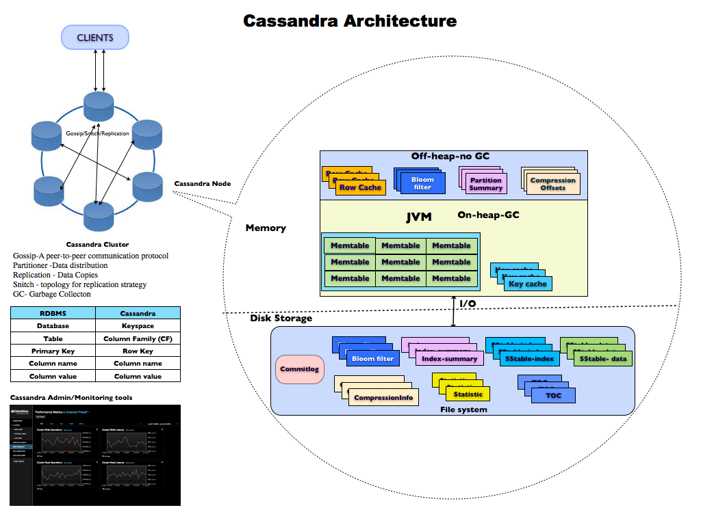
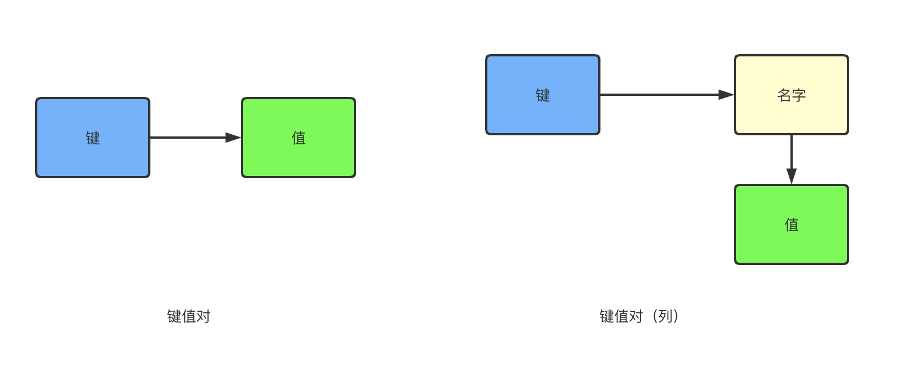
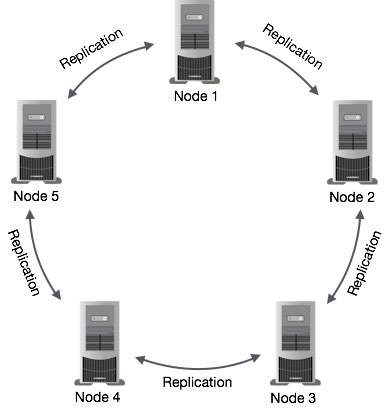

### 大数据技术简介

#### 引言

大数据相关技术介绍。

#### 分布式数据处理

关系型数据库使用分布式处理架构的问题:
1. 对RDBMS的依赖
事务管理ACID
一致性管理
系统延迟
网络较慢
数据库I/O
2. SAN架构
3. 基础设施成本
4. 复杂的数据处理和转换要求
5. 最小容错能力与昂贵的容错解决方案

NoSQL等分布式数据库基本原则：
1. 最大程度的并行处理
2. 最小的数据库使用
3. 基于分布式文件的存储
4. 线性可扩展的基础设施
5. 高速复制
6. 高可用
7. 容错能力
8. 本地化数据处理和结果存储，计算和存储在同一磁盘

#### 大数据处理需求

1. 数据量：数据量很大，需要跨系统并行处理，并且需要一次性处理完成
2. 速度
3. 多样性：不同格式、类型、结构和区域

#### 大数据处理技术

Google文件系统：GFS

架构图：

GFS集群：
单个主节点
每个节点对应多个块服务器
支持多客户端访问

文件：
用固定大小的数据块（64Mb）表示
用64位唯一id标记
存储在块服务器且有三个服务器镜像

主节点的作用是与客户端通信，告诉客户端块数据位置以及元数据信息，客户端之后会直接与块服务器交互，因此主节点不会成为瓶颈。为了避免主节点和所以的
元数据单点故障，出于速度考虑，GFS在内存中保存数据，在本地磁盘保存日志，在远程节点复制磁盘。

#### Hadoop

Hadoop第一代包括HDFS、MapReduce框架以及接口

Hadoop相关的开源项目：
Avro - 数据序列化系统
Cassandra - 可扩展多主节点数据库
Chukwa - 管理大型分布式系统的数据采集系统
HBase - 支持存储大型表的结构化数据存储，可扩展分布式数据库
Hive - 数据仓库
Mahout - 可扩展的机器学习和数据挖掘库
Pig - 并行计算的高级数据流语言和执行框架
Zookeeper - 用于分布式应用的高性能协调服务

**Hadoop核心组件**

1. HDFS

HDFS是一个高容错、可扩展的分布式文件系统

**命名节点：** 命名节点是单个主服务器，它管理文件系统命名空间以及控制客户端对文件的访问，管理块到数据节点的映射。
**数据节点：** 从节点，保存数据，可以并发执行多个任务
**心跳线：** 命名节点和数据节点通过每三秒发送的心跳线管理。心跳线包含存储容量、使用中的存储以及数据传输次数，这些数据由命名节点统计用来管理空间分配和负载均衡

十分钟没有收到心跳线，命名空间就会任务数据节点停止服务。

**MapReduce:** 处理大数据集的编程模型，基于函数编程模型，框架包括不同的接口库，映射器、归约器、报告器、合并器、分区器等。

Map: 输入的键值对到计算后产生的中间键值对集合
Reduce: 接受中间键机器对应值的集合，处理值集合

问题：1.可扩展性，2.单点故障

**MapReduce v2(YARN)**

主要组件：
1. 资源管理器ResourceManager(RM)
调度器：负责资源分配，进度管理
应用管理器：接受作业提交，失败时重启AM容器

2. 节点管理器

负责启动应用容器，设置任务执行环境，管理本地存储

3. 应用主节点ApplicationMaster(AM)

与RM协商资源，管理任务执行，恢复失败的应用

#### Zookeeper

Zookeeper是开源的、基于内存的、分布式的NoSQL数据库，用于管理分布式应用的协调服务。
Zookeeper架构基于一个称为zNode的层次命名空间结构，
Zookeeper主要为了储存协调数据：状态信息、配置、位置信息等，数据量不大

**Zookeeper提供数据一致性模型**
1. 顺序一致性
2. 原子性
3. 单一系统映像
4. 持久性
5. 及时性

应用于：
1. 配置服务 - 配置更新和发生变化提醒
2. 锁 - 互斥锁
3. 领导者选举 - 仅有一个
4. 组成员身份
5. 队列生产者/消费者范式

**运行模式**
1. 单机 - 独立模式
2. 复制模式 - 集群， 部署奇数台

使用Zab两阶段协议来确保分布式一致性。
1. 领导者选举，写操作通过领导者完成，然后作为更新向追随者广播。读操作由领导者或追随者在内存中完成，保证最终一致。
2. 原子广播，更新要么成功要么失败，领导者收到写操作后，要先同步给追随者，超过一半的追随者完成更新（第一阶段），领导者才提交更新（第二阶段）

在Hadoop中的作用：
1.管理跨节点的配置
2.实现可靠的消息传递
3.实现冗余服务
4.同步进程执行

#### Pig

**Apache pig** 是一个用于分析大型数据集的平台。Pig包括一种高级语言。语言架构是一种文本语言平台（Pig Latin）

Pig是脚本语言，用于浏览大数据集

>本地模式下, pig运行在单独的JVM中，适合小数据集
>在MapReduce模式下，pig将查询转换为MapReduce作业


#### HBase

HBase 基于Google的bigtable，是一个开源、非关系型、面向列、多维、分布式的数据库。具有很强的扩展性、支持某些ACID

架构：数据按照行、列和表进行组织


>表：由行和列组成，表的单元格是行列的交叉点，默认由时间戳进行版本控制，表的行有一个可排序的行键和**任意数量**的列
>行：表的行键是字节数组，可以是任何数据，表的行由行键（表的主键）按字节顺序排序，表的访问由主键进行，列可以分为 "簇"
>列：在HBase行的列分组为列簇，所有列簇成员有一个共同的前缀，例 person:name是列簇person的成员，新列簇成员可以按需求添加




HBase **主节点**(`HMaster`)是主要的操作控制器，功能如下：
>负责检测区域服务器（HRegionServer）
>区域负载均衡
>重定向客户端到正确的区域服务器

HBase **区域服务器**(`HRegionServer`)是从节点，功能如下：
>存储数据和它的元数据
>为客户端请求（写入/读取/扫描）提供服务
>向主节点发送心跳线
>在拆分和数据分发时管理数据分解与主节点的同步


HBase 客户端是一个编程API

Zookeeper用来协调主节点和区域服务器间的活动。HBase如何管理？HBase有两个特殊目录表，ROOT和META，ROOT表包含META表区域列表，META表
包含所有用户空间区域列表。

ROOT和META表中的条目都使用区域名称作为主键，区域名称由表名称、起始行、创建时间和一个散列键值组成，行键默认排序

**预写式日志**：写入数据顺序
1. 先在内存处理
2. 内存已满，把数据刷新到日志文件。该文件用于HBase崩溃恢复时使用
这种就是预写式日志，目标是确保故障恢复
3.当内存中保存足够的数据后，最后还要把数据刷新到磁盘,遵循以下顺序： 
3.1 数据更新先写入日志
3.2 日志是持久化和可复制的，只有日志完全写好，系统才会通知客户端操作成功

#### Hive

Hive 是建立在Hadoop上的开源数据仓库解决方案。
Hive支持 类SQL语言 HiveSQL

Hive架构：(如图所示)


* 元存储-存储系统目录以及元数据
* 驱动程序
* 查询编译器（遵循DAG模型），将HiveSQL编译为任务
* 执行引擎 按照依赖顺序处理、执行任务
* Thrift服务器 提供Thrift接口，一个JDBC/ODBC 服务器， `ThriftServer`
* CLI 和Web UI 客户端接口
* 接口 可扩展接口， SerDe, UDF, UDAF等

基础组件：
* 元存储
* 数据库。表命名空间
* 表。 由数据和元数据组成，位于HDFS
* 分区。一个分区基于分区的列的值（一个值对应一部分数据），分区可以细分为桶，类似于子分区，每个分区可以有其自己的列、SerDe和存储信息。


#### Chukwa 监测系统

**Chukwa** 是监测大型分布式系统的开源数据采集系统，建立在HDFS和MapReduce之上

#### Flume 日志采集

**Flume**是分布式、可靠和可用的服务，用于采集、聚合和移动大量日志数据

#### Oozie 工作流系统

**Oozie**是一个工作流/协调系统，用于管理Hadoop作业

#### HCatalog 集成元数据层

**HCatalog**建立在Hive元存储上，集成了Hive的DDL组件，HCatalog抽象提供了HDFS数据的关系视图

#### Sqoop 数据集成

#### NoSQL

**NoSQL**指那些在类似架构工作但专业不同的工作负载而构建的数据库

#### CAP定理

在分布式系统中，你只能保证下面三个要求中的两个：一致性C（节点或系统中所有可用数据），可用性A（每个请求会得到一个响应），分区容错性P（系统运作不管可用性、分区
、数据或通信丢失），基于此构建的系统称作BASE（基本可用软状态最终一致），不满足ACID。

相关解决方案：HBase、MongoDB、Neo4J、Cassandra、HyperTable、Memcached、Redis等

* HBase、HyperTable 满足CP性质
* Cassandra 满足AP，保证最终一致性

#### 列簇存储：Cassandra

**Cassandra**是Facebook基于谷歌bigtable数据模型和Dynamo基础架构建立的。

##### 数据模型



Cassandra基于键-值模型，一个键用于唯一标识一个值，类似指针和链表

* 列。 列是值的有序列表，一个键值对由列名、列的值和时间戳组成，时间戳用于管理冲突
* 列支持任何数据类型，字符、全局唯一标识、二进制大对象都支持。列进行分组成为一行。称为行键row key
* 列簇。列簇是列集合的逻辑和物理分组

##### 数据分区

1. 随机分区器 - 基于哈希分布，在不同节点，键可以平均分区，有更好的负载均衡
2. 顺序保护分区器 - 基于键和通过键分组的数据创建分区，顺序分区，可以提高查询性能

##### 数据排序

可以指定列的排列顺序
* BytesType - 按字节值简单排序
* AsciiType - Ascii编码排序，验证编码
* UTF8Type - UTF-8编码的字符串
* LongType - 64位场
* LexicalUUIDType - 128位UUID，按字典排序
* TimeUUIDType - 128位UUID，按时间戳比较
* 整数 - 按数值排序

##### 一致性管理

AP(可用性和分区)和最终一致性，对于一行数据，Cassandra 通过有多少最近和并发的所有副本来衡量一致性。
可调一致性模型，客户端可以定义一致性级别，这取决于它的复制因子。

##### 读、写一致性

有强弱一致性级别做选择，

|级别| 读一致性|写一致性|
|:---|:---|:---|
|ANY	|至少一个节点响应写操作。如果请求的row key对应的所有的副本节点都停止了，接收到请求的节点会记录HINT消息和请求数据，然后响应写成功。在row key对应的所有副本节点至少有一个启动之前，所有读row key会失败。并且HINT消息只保留一段时间，如果在这段时间内所有副本节点还不可用，则数据会丢失。|无|
|ONE	|集群中至少有1个副本节点写成功。| 返回集群最近副本(决定于snitch)的响应。|
|TWO	|集群中至少有2个副本节点写成功。| 返回集群里2个最近副本中的最新数据。|
|THREE	|集群中至少有3个副本节点写成功。| 返回集群里3个最近副本中的最新数据。|
|QUORUM	|集群中至少有quorum个副本节点写成功.quorum=(各数据中心副本因子之和)/2 + 1，假如2个数据中心，1个数据中的副本因子3，1个数据中心的副本因子是2，quorum=(3+2)/2 + 1 = 3|返回集群里quorum个副本中的最新数据。quorum=(各数据中心副本因子之和)/2 + 1，假如2个数据中心，1个数据中的副本因子3，1个数据中心的副本因子是2，quorum=(3+2)/2 + 1 = 3|
|LOCAL_QUORUM	|集群中同1个数据中心至少有quorum个副本节点写成功。quorum=(本数据中心副本因子)/2 + 1，假如接受请求的节点所在的数据中心的副本因子是2，则quorum=(2)/2 + 1 = 2|返回集群里当前数据中心quorum个副本中的最新数据。quorum=(本数据中心副本因子)/2 + 1，假如接受请求的节点所在的数据中心的副本因子是2，则quorum=(2)/2 + 1 = 2|
|EACH_QUORUM	|集群中每个数据中心至少有quorum个副本节点写成功。quorum计算同LOCAL_QUORUM。|返回集群中每个数据中心至少有quorum个副本中的最新数据。quorum计算同LOCAL_QUORUM。|
|ALL	|集群中所有副本节点写成功。|返回集群中所有副本中的最新数据。所有副本做出反应，则返回数据，否则，操作失败|

###### 指定客户端一致性级别

```sql
select * from t1 where c1=1 USING CONSISTENCY QUORUM;
```

##### 一致性修复

* 读修复。检测到节点不同步时，会用读修复标志标记该节点。不一致检查是通过比较数据的时间戳和最新时间戳来实现。
* 反熵节点修复。
* Merkle树是一种散列键层次结构验证和身份验证技术。
* 线索化的切换、写操作中，数据默认为所有副本，一个节点停止，数据将另存为线索，以在节点复活时恢复节点，如果所有副本都停止了，线索和数据
就存储到协调器中。称为线索化切换。节点不允许任何操作直到所有节点恢复。

##### Cassandra 环形结构



##### 点对点

对等模型，没有主设备或从节点

##### Gossip协议：节点管理

使用**Gossiper类**实现，把一个节点添加到集群时，它也注册Gossiper来接受通信。Gossoper选择随机节点并通过发消息判断是否活动，如果无反应，如果配置提示切换，
则Gossiper类触发"提示切换"过程。

**Phi权责发生制故障检测算法**：根据一个节点做出反应的时间来把它标记为可疑节点，延迟越长越怀疑它终止了，通过与临界值比较来确定状态。

#### 图数据库

图数据库每个对象表示节点，关系为边。