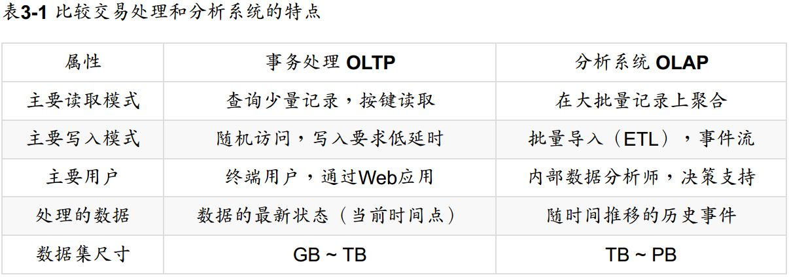

# 数据存储与检索

## 数据库核心：数据结构

简单的数据库实现：使用 shell 脚本编写两个方法 get 和 set，存储时将输入存储到文本文件中，查询时遍历整个文件。

如：

```shell
#!/bin/bash

db_set () {
  # $1 和 $2 是两个输入参数，将输入用逗号分隔并重定向到 database 文件中
  echo "$1,$2" >> database
}

db_get () {
  grep "^$1," database | sed -e ...
}
```

插入时只需要执行 `db_set key1 value1` 即可将 key 为 "key1"，value 为 "value1" 的数据存储到数据库中。

对于普通情况来说，追加到文件尾部的方式通常都很高效，许多数据库内部也都使用日志。但是如果日志存储了大量数据，那么 db_get 函数性能会非常差，它的时间
复杂度为 _O(n)_。

为了提高查询速度，我们需要**索引**。索引是基于原始数据派生而来的额外数据结构。很多数据库允许单独添加和删除索引，而不影响存储的数据。

### 哈希索引

索引策略：保存内存中的 hashmap，把每个键映射到数据文件的一个偏移量上。

如何避免用尽磁盘空间？一个解决方案是将日志分解成一定大小的段，当文件达到一定大小时就关闭它，并将后续写入到新的段上。然后就可以对段进行压缩，对于重复
的 key 我们可以只保留最后一个记录。运行时后台线程处理压缩，原来的段还继续工作，直到新段合并完成才删除旧段。

实际中海油许多需要考虑的问题：

_文件格式_  
&nbsp;&nbsp;&nbsp;&nbsp;CSV 不是日志的最佳格式。考虑到效率，二进制更快一些。
_删除记录_  
如果要删除某个记录就必须在日志中追加一个删除标记（成为墓碑）。合并日志段时，遇到墓碑标记就丢弃这个键。
_崩溃恢复_  
&nbsp;&nbsp;&nbsp;&nbsp;如果数据库重新启动，则内存中的 hashmap 将丢失。Bitcask 通过将每个段的 hashmaop 快照存储在磁盘上来加快恢复速度。
_部分写入的记录_  
&nbsp;&nbsp;&nbsp;&nbsp;数据库可能随时崩溃，Bitcask 文件包含校验值，这样可以发现受损部分并丢弃它。
_并发控制_  
&nbsp;&nbsp;&nbsp;&nbsp;由于写入以严格的先后顺序追加到日志中，通常会只有一个县城执行写入。

使用追加而不是更新的写入方式的主要原因是：

* 追加是顺序写，更新是随机写，顺序写比随机写快很多。
* 段文件是追加的（写入后不可变），发生崩溃时更好恢复。
* 合并旧段可以防止文件出现碎片化问题。

局限：

* 哈希表必须放入内存，如果键很多，就需要很大的内存空间。另外，哈希冲突的处理也比较复杂。
* 区间查询效率不高，因为哈希是散列的。

### SSTables 和 LSM-Tree

SSTables：按照键值对键的顺序排序。  
LSM-Tree：以日志结构的合并树（Log-Structured Merge-Tree）。

### B-trees

B-tree 始于 1970 年。B-tree 将数据库分解成固定大小的块或页，传统上大小为 4KB，页是内部读/写的最小单元。底层的磁盘也是以固定大小的块排列。

更新时，首先要搜索该键的叶子页，更改该页的值，并将页写回磁盘。如果要添加新键，则需要找到范围包含该键的页，并添加进去。如果没有足够空间，则将页分裂为
两个页。大多数数据库有 3~4 层的 B-tree。

### 使 B-tree 可靠

B-tree 底层的基本写操作是使用新数据覆盖磁盘上的旧页。可以认为磁盘上的页覆盖写对应确定的硬件操作。在磁性硬盘上，磁头首先移动到正确的位置，然后旋转盘
面，最后用新的数据覆盖相应的扇区。对于 SSD 更为复杂，因为 SSD 必须一次擦除并重写非常大的存储芯片块。

为了使数据库能从崩溃中恢复，可以用**预写日志**（write-ahead log，WAL）。

### 优化 B-tree

* 通过写时复制方案而不是 WAL 进行崩溃恢复。修改的页被写入不同的位置。
* 保存键的缩略信息，而不是完整的键，以节省页空间。
* 添加额外的指针到树中，比如叶子页指向左右同级子叶的指针。

### 其他索引结构

#### 在索引中存储值

索引中的值分为两类：  
1. 上述的实际行（文档，顶点）；
2. 对其他地方存储的行的引用，存储行的具体位置被称为堆文件。

索引行直接存储在索引中被称为**聚集索引**。

#### 多列索引

多列索引类型称为级联索引，它通过将一列追加到另一列，将几个字段简单地组合成一个键。

#### 在内存中保存所有内容

一些内存中的 key-value 存储（如 Memcached），主要用于缓存，有些旨在实现持久性。

## 事务处理与分析处理



### 数据仓库

#### 星型与雪花分析模式

星型模式也称为维度建模。模式的中心是一个事实表，事实表每一行表示在特定时间发生的事件。

雪花模式是星型模式的变种，维度进一步细分为子空间。

## 列式存储

虽然事实表可能超过 100 列，但是查询可能只需要返回几列。在大多数 OLTP 中，存储面向行。

面向列存储想法很简单：不要将一行的所有值存储在一起，而是将每列中的所有值存储在一起。每个列存储在一个单独的文件中。

### 列压缩

列存储很适合压缩。

位图编码：一个零售商可能有数十亿的销售订单，但是商品可能只有几十万中，那么我们可以用一个位图代表其中一个商品，这样只需要几兆就可以存储（将商品组成一个
连续的二进制数组，如果行具有该值，则为1，否则为0）。

### 聚合：数据立方体与物化视图

数据仓库查询通常涉及聚合函数，如 count、sum、avg、max。如果很多查询都需要相同的聚合，那么我们可以缓存起来。创建这种缓存的一种方式叫物化视图。

数据立方体：由不同维度组合成的聚合网格，比如一个二维表，如果沿着行或列进行聚合操作就可以减少一个维度（固定一个维度的条件）。它的优点是查询快，因为已经
预先计算出来聚合结果，缺点是不灵活。

## 小结

OLTP 主要有两个流派：

* **日志结构流派**，它只允许追加式更新文件和删除过时的文件，但不会修改已写入的文件。BitCask、SSTables、LSM-Tree、Cassandra、HBase、Lucene
等属于此类。
* **原地更新流派**：将磁盘视为可以覆盖的一组固定大小的页。B-tree 属于这种。