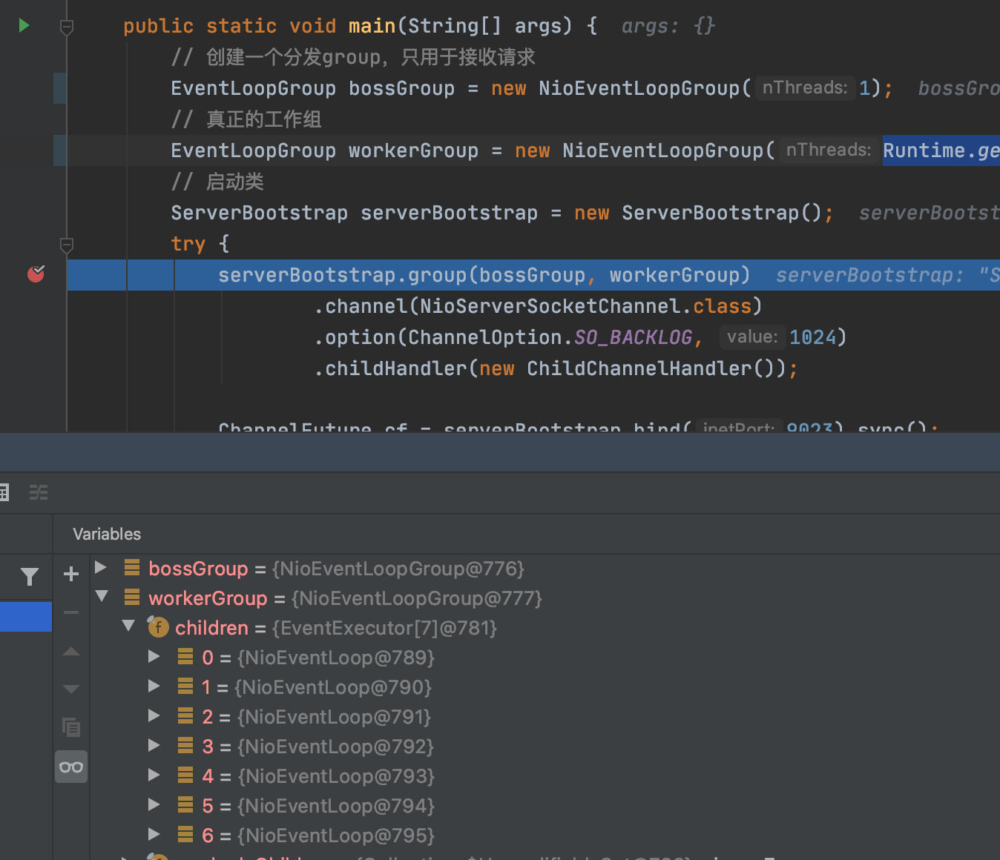

# 第三章 - Netty 入门应用

## 3.1 Netty 开发环境搭建

下载Netty依赖包 [https://netty.io/](https://netty.io/) 或者创建一个maven项目引入maven依赖。

```xml
<!-- https://mvnrepository.com/artifact/io.netty/netty-all -->
<dependency>
    <groupId>io.netty</groupId>
    <artifactId>netty-all</artifactId>
    <version>4.1.63.Final</version>
</dependency>
```

## 3.2 Netty 服务端开发

1. 创建两个 `NioEventLoopGroup`，一个是boss一个是worker，NioEventLoopGroup 是个线程组，它包含了一组NIO线程，专门用于网络的处理，实际上
它们就是Reactor线程组。一个用于接收客户端的连接，另一个用于SocketChannel的网络读写。



2. 接着使用group方法，将两个group传递到ServerBootstrap中，接着设置channel，设置TCP参数，将backlog设置为1024，最后绑定I/O事件的处理类handler。
3. 配置完成后，调用bind方法绑定监听端口，随后调用同步阻塞方法sync等待绑定操作完成。
4. 调用NIO的shutdownGracefully进行优雅退出。

参考代码：[https://github.com/RollsBean/io-demo/blob/master/netty/src/main/java/demo/NettyServer.java](https://github.com/RollsBean/io-demo/blob/master/netty/src/main/java/demo/NettyServer.java)

## 3.3 Netty 客户端开发

1. 创建NIO 线程组
2. 创建辅助启动类BootStrap并进行配置
3. 开启异步连接
4. 最后，客户端关闭连接后，客户端主函数退出，退出前释放NIO 线程组的资源

参考代码：[https://github.com/RollsBean/io-demo/blob/master/netty/src/main/java/demo/NettyClient.java](https://github.com/RollsBean/io-demo/blob/master/netty/src/main/java/demo/NettyClient.java)

