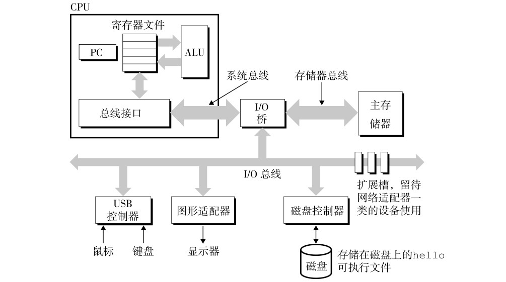
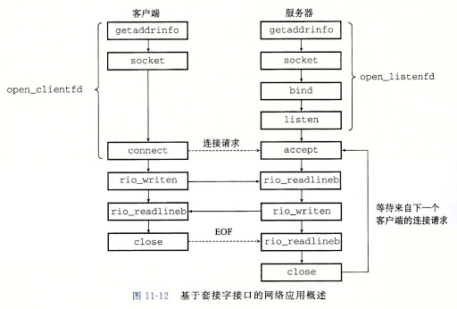

# 第一节-前言-计算机基础

## 计算机组成

计算机主要由CPU、内存、IO等组成。

**CPU**: 中央处理单元，负责计算。
其中**PC**是程序计数器，**ALU**是算术/逻辑单元，**USB**是通用串行总线。

**内存**：程序运行在内存中，包括用户程序和操作系统程序（内核 kernel）

**IO**: 网卡、硬盘、输入输出设备（键盘、鼠标、显示器等）



## 操作系统内核


## 系统级I/O

**输入/输出（I/O）** 是在主存和外部设备（磁盘驱动器、网络等）之间拷贝数据的过程。

### Unix I/O

文件就是一个m个字节序列。

步骤：

* **打开文件**：应用程序要求内核打开相应的文件，内核返回一个小的非负整数，叫做**描述符**
* **改变当前的文件位置**：对于每个打开的文件，内核保持一个文件位置k，初始为0，它是从文件头开始的字节偏移量。
* **读写文件**：读操作是从文件拷贝n>0个字节到存储器，从当前文件位置k开始，加到k+n。给定m字节，当k>=m时。触发EOF（文件末尾）。
* **关闭文件**：应用程序访问完成后，通知内核关闭文件，内存会释放打开文件创建的数据结构，并将描述符恢复到描述符池中。

### 文件描述符 (file descriptor)

**文件描述符**（file descriptor）是内核为了高效管理已被打开的文件所创建的索引，其是一个非负整数（通常是小整数），用于指代被打开的文件，所有执行
I/O操作的系统调用都通过文件描述符。程序刚刚启动的时候，_0_ 是**标准输入**，_1_ 是**标准输出**，_2_ 是**标准错误**。

**POSIX标准**要求每次打开文件时（含socket）必须使用当前进程中 _**最小可用**_ 的文件描述符号码

## 网络编程

### 套接字接口（socket interface）

套接字接口是一组函数，用于创建网络应用。




#### socket 函数

客户端和服务器都使用`socket`函数用来创建**套接字描述符（socket descriptor）**

```java
int socket(int domain, int type, int protocol);
```

使用socket
```java
#include <sys/socket.h>

clientfd = Socket(AF_INET, SOCK_STREAM, 0);
```

**AF_INET**表示正在使用因特网；

**SOCK_STREAM**表示这个套接字是因特网连接的一个端点

clientfd是socket返回的描述符，仅仅是部分打开，还不能用于读写。

#### connect 函数

客户端通过调用connect 函数来建立和服务器的连接。

```java
#include <sys/socket.h>

int connect(int sockfd, struct sockaddr *serv_addr, int addrlen);
```

以上，connect函数会和套接字地址serv_addr服务器建立连接，connect函数会一直**阻塞**，一直到**连接成功**建立或者**发生错误**。如果成功
sockfd描述符就准备好读写了。

#### open_clientfd 函数

socket、connect的组合函数

#### bind 函数

服务器用来和客户端建立连接。

```java
#include <sys/socket.h>

int bind(int sockfd, struct sockaddr *my_addr, int addrlen);
```

bind函数告诉内核将my_addr中的服务器套接字地址和套接字描述符sockfd连接起来。

#### listen 函数

**服务器**调用listen函数告诉内核，描述符是被服务器而不是客户端使用的。

```java
#include <sys/socket.h>

int listen(int sockfd, int backlog);
```

#### open_listenfd 函数

open_listenfd 将socket、bind和listen函数结合起来。

```java
#include <sys/csapp.h>

int open_listenfd(int port)
```


#### accept 函数

服务器调用accept 函数来等待来自客户端的连接请求。

```java
#include <sys/socket.h>

// 返回：成功则为非负连接描述符，出错则为-1
int accept(int listenfd, struct sockaddr * addr, int * addrlen);
```

**EOF的概念**：
>EOF是由内核检测到的一种条件。
>如下条件发送EOF：    
>应用程序在它接收到一个由read函数返回的零返回码时；  
>对于磁盘文件，当前文件位置超出文件长度；  
>对于因特网连接，当一个进程关闭连接它的那一端时；    
>连接另一端的进程在读取到流中最后一个字符后的字节时。 
 
